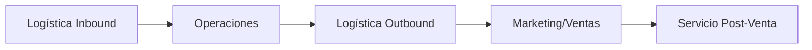

# Clase 01: Introducción a la Gestión de Operaciones

## 🎯 Introducción

Imagina que eres el director de orquesta de una gran sinfonía. Cada músico representa un departamento en una empresa, y tu trabajo es asegurarte de que todos toquen en armonía para crear una experiencia perfecta. La Gestión de Operaciones es precisamente eso: coordinar todos los recursos y procesos para entregar valor al cliente final. En esta clase, exploraremos cómo las decisiones estratégicas en operaciones pueden marcar la diferencia entre el éxito y el fracaso de una empresa.

### ¿Qué es la Gestión de Operaciones?

Es el arte y la ciencia de diseñar, planificar y controlar los sistemas que producen bienes y servicios. Piensa en cómo un restaurante gestiona sus ingredientes, cocineros y meseros para servir tu plato favorito a tiempo y con calidad.

- **Característica 1**: Enfoque en procesos de transformación (de materias primas a productos terminados).
- **Característica 2**: Uso de herramientas cuantitativas y cualitativas para resolver problemas.
- **Característica 3**: Alineamiento con la estrategia competitiva de la empresa.

> 💡 Dato importante: Según testimonios de exalumnos, conceptos como "cadena de suministro" y "gestión de inventarios" son aplicados diariamente en empresas como Mercado Libre y Nestlé.

## 📊 Conceptos Principales

### 1. Cadena de Valor

**Explicación simple**: Todas las actividades que agregan valor a un producto, desde la materia prima hasta el cliente final.  
**Analogía**: Como una carrera de relevos donde cada corredor (etapa del proceso) debe pasar el testigo (producto) eficientemente.  
**Ejemplo**: En Zara, el diseño, fabricación y distribución están integrados para llevar moda a tiendas en solo 2 semanas.

### 2. Tipos de Decisiones

**Estratégicas** (ej: construir una nueva fábrica) vs. **Operativas** (ej: programar turnos de producción).  
**Ejemplo**: Toyota decidió ubicar plantas en EE.UU. (estratégico) y luego optimizó sus líneas de ensamble (operativo).

### 3. Matriz Producto-Proceso

$$\text{Volumen} \times \text{Estandarización}$$

- **Proyectos**: Aviones Airbus (bajo volumen, alta personalización).
- **Producción continua**: Refinerías de petróleo (alto volumen, alto estandar).

## 💻 Herramientas y Recursos

- **Básico**: Diagramas de flujo (para mapear procesos).
- **Avanzado**: Software de simulación (como el usado en la competencia del 25/04).

## 📈 Aplicaciones Prácticas

1. **Walmart**:

   - Estrategia: "Precios bajos siempre".
   - Tácticas operativas: Cross-docking (reducir inventarios), sistema satelital para comunicación entre tiendas.

2. **Nestlé**:
   - Uso de pronósticos de demanda para planificar producción de leche en polvo.

## 🎓 Ejercicio Práctico

**Problema**: Una panadería produce 200 baguettes/día con un costo de \$1/unidad. El 10% se pierde por mala calidad.  
**Paso 1**: Calcular pérdidas diarias:  
$$200 \times 0.10 \times \$1 = \$20$$
**Paso 2**: Si mejoran calidad reduciendo desperdicio al 5%, ahorran \$10/día (\$3,650/año).

## 🔑 Consejos Clave

1. Siempre relaciona las decisiones operativas con la estrategia global.
2. La variabilidad (ej: demanda impredecible) es el enemigo silencioso de las operaciones.
3. Usa datos para tomar decisiones, pero complementa con juicio experto.

## 📝 Conclusión

Como el director de orquesta, un buen gestor de operaciones debe conocer cada instrumento (proceso) y cómo sincronizarlos. Los conceptos vistos hoy son la partitura inicial para crear valor en cualquier organización.

## 📚 Fórmulas Relevantes

1. **Costo por desperdicio**:  
   $$\text{Unidades} \times \text{\% Desperdicio} \times \text{Costo Unitario}$$

## 🔍 Recursos Adicionales

- Libro: _La Meta_ (disponible en Canvas).
- Simulador de cadena de suministros para practicar (actividad del 25/04).
