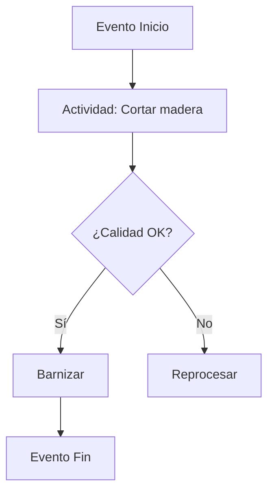

# Clase 02: Análisis de Procesos y Capacidad

## 🎯 Introducción

Imagina que eres el chef ejecutivo de un restaurante de hamburguesas. Cada paso en la cocina (cortar pan, cocinar carne, ensamblar) es como una estación en una línea de producción. Si una estación se atasca (¡el cuello de botella!), todo el sistema se ralentiza. Hoy aprenderemos a diagnosticar y optimizar estos flujos usando herramientas como BPMN y la Teoría de Restricciones.

### ¿Qué es el Análisis de Procesos?

Es el estudio sistemático de cómo los recursos (personas, máquinas) transforman insumos en productos/servicios.  
**Ejemplo**: En una fábrica de sillas, el proceso incluye cortar madera, ensamblar y barnizar.

> 💡 Dato clave: Según Goldratt, **"la cadena es tan fuerte como su eslabón más débil"** (el cuello de botella limita toda la capacidad del sistema).

---

## 📊 Conceptos Principales

### 1. Modelado con BPMN

**Explicación**: Notación gráfica para mapear procesos.  
**Analogía**: Como un plano arquitectónico, pero para flujos de trabajo.  
**Elementos clave**:

### 2. Métricas de Procesos

- **Tiempo de Ciclo**: 30 min/silla (ej: ensamblado).
- **Capacidad**: Máx. 16 sillas/día si un operario trabaja 8 horas.
- **Utilización**: % de tiempo activo vs. disponible (ej: 100% en ensamblado = cuello de botella).

**Fórmula**:
$$\text{Capacidad} = \frac{\text{Tiempo Disponible}}{\text{Tiempo por Unidad}}$$

### 3. Teoría de Restricciones (TOC)

**Pasos**:

1. Identificar cuello de botella (ej: estación de ensamblaje).
2. Explotarlo (evitar tiempos muertos).
3. Subordinar todo al cuello (ej: no cortar más madera de la que se puede ensamblar).

---

## 💻 Herramientas

| Tipo             | Ejemplo                    | Uso                                    |
| ---------------- | -------------------------- | -------------------------------------- |
| **Diagramación** | BPMN, VSM                  | Mapear flujos y detectar cuellos       |
| **Simulación**   | AnyLogic, Simio            | Probar escenarios antes de implementar |
| **Optimización** | LP Solvers (Excel, Python) | Maximizar capacidad o minimizar costos |

---

## 📈 Aplicaciones Prácticas

1. **McDonald’s "Made for You"**:

   - **Problema**: Hamburguesas pre-cocinadas se enfriaban.
   - **Solución**: Re-diseñar proceso para cocinar después del pedido (↑ frescura, ↓ desperdicio).

2. **Fábrica de Sillas**:
   - **Cuello de botella**: Ensamblado (30 min/silla).
   - **Mejora**: Añadir un segundo operario → capacidad sube de 16 a 32 sillas/día.

---

## 🎓 Ejercicio Práctico

**Problema**: Panadería con 3 estaciones:

1. Amasar (10 min/pan).
2. Hornear (15 min/pan, 1 horno).
3. Decorar (5 min/pan).

**Preguntas**:
a) ¿Cuál es el cuello de botella?
b) Capacidad total por hora.
c) Si se añade un horno, ¿cuál es la nueva capacidad?

**Solución**:
a) Hornear (15 min/pan).
b) 4 panes/hora (60/15).
c) 6 panes/hora (ahora limita amasar: 60/10).

---

## 🔑 Consejos Clave

1. **Prioriza por margen en el cuello de botella** (ej: SKU con mayor$/hora en recurso limitante).
2. **Paraleliza actividades** (como en la fábrica de sillas).
3. **Mide la utilización** para identificar sobrecargas.

---

## 📝 Conclusión

Optimizar procesos es como dirigir tráfico: identificar embotellamientos (cuellos), redistribuir cargas (paralelizar) y mantener el flujo (TAKT time = ritmo de demanda). ¡Haz que tu "sinfonía operacional" suene armoniosa!

## 📚 Fórmulas Relevantes

1. **Capacidad**:$$\text{Unidades} = \frac{\text{Tiempo Disponible}}{\text{Tiempo por Unidad}}$$
2. **TAKT Time**:$$\frac{\text{Tiempo Disponible}}{\text{Demanda}}$$
3. **Utilización**:$$\frac{\text{Tiempo Activo}}{\text{Tiempo Disponible}} \times 100\%$$

## 🔍 Recursos Adicionales

- Libro: _La Meta_ (Goldratt) - Novela sobre TOC.
- Software: Bizagi Modeler (gratis para BPMN).
- Video: "Cómo McDonald’s reinventó su cocina" (YouTube).
