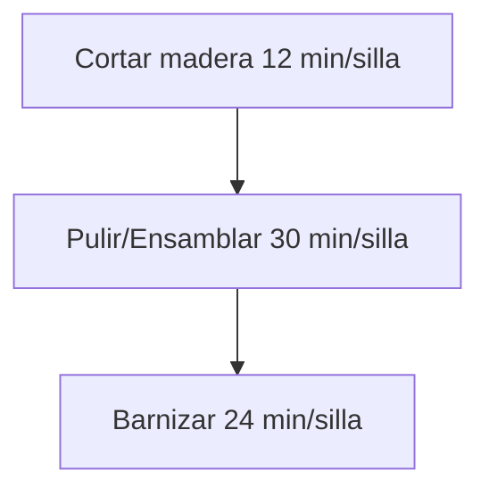
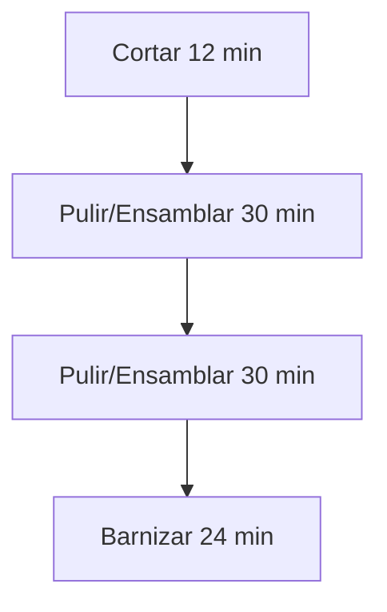
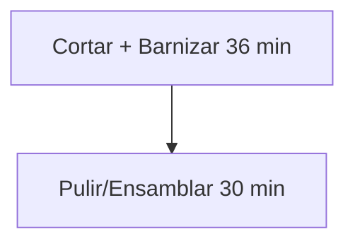
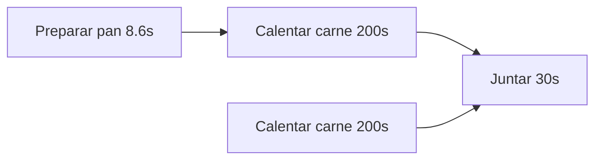
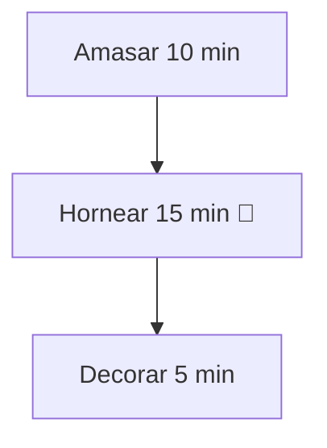

# **Clase 02: Optimización de Procesos Productivos**

**Caso: Fábrica de Sillas y Hamburguesería**

---

## **📌 Introducción**

Los procesos productivos son como **cadenas de montaje**: si un eslabón es lento, limita toda la producción. Hoy analizaremos:  
✅ **Cuellos de botella**  
✅ **Capacidad vs. Utilización**  
✅ **Estrategias de mejora**

> **💡 Concepto clave**: _"La capacidad del sistema está limitada por su operación más lenta."_

---

## **📊 Proceso Base: Fábrica de Sillas**

### **🔹 Diagrama del Proceso (Mermaid)**

### **🔹 Capacidad por Operación (8h/día)**

| **Operación**       | **Tiempo/silla** | **Capacidad/día** | **Utilización** |
| ------------------- | ---------------- | ----------------- | --------------- |
| **Cortar**          | 0.2 h (12 min)   | 40 sillas         | **40%**         |
| **Pulir/Ensamblar** | 0.5 h (30 min)   | 16 sillas         | **100%** 🚨     |
| **Barnizar**        | 0.4 h (24 min)   | 20 sillas         | **80%**         |

**📌 Conclusión**: **El ensamblado es el cuello de botella** (limita la producción a **16 sillas/día**).

---

## **⚡ Alternativas de Mejora**

### **🔸 Opción 1: Añadir un 2do Operario en Ensamblado**

**📊 Nueva Capacidad**  
| **Operación** | **Capacidad/día** | **Utilización** |  
|----------------------|-------------------|-----------------|  
| **Cortar** | 40 sillas | **50%** |  
| **Pulir/Ensamblar** | 32 sillas | **62.5%** |  
| **Barnizar** | 20 sillas | **100%** 🚨 |

**📌 Resultado**: **20 sillas/día** (ahora el barnizado es el nuevo cuello de botella).

---

### **🔸 Opción 2: Reasignar Tareas (Combinar Corte + Barnizado)**

**📊 Nueva Capacidad**  
| **Operación** | **Capacidad/día** | **Utilización** |  
|---------------------------|-------------------|-----------------|  
| **Cortar + Barnizar** | 13.3 sillas | **100%** 🚨 |  
| **Pulir/Ensamblar** | 16 sillas | **83%** |

**📌 Resultado**: **13.3 sillas/día** (menor producción, pero menos operarios).

---

## **💰 Evaluación Económica**

| **Opción**                 | **Operarios** | **Costo Diario** | **Producción** | **Costo/Silla** |
| -------------------------- | ------------- | ---------------- | -------------- | --------------- |
| **Original**               | 3             | $30,000          | 16 sillas      | **$1,875**      |
| **Opción 1 (+1 operario)** | 4             | $40,000          | 20 sillas      | **$2,000**      |
| **Opción 2 (Reasignar)**   | 2             | $20,000          | 13.3 sillas    | **$1,504**      |

**📌 Conclusión**: **La Opción 2 es más económica**, pero reduce producción.

---

## **⏳ Cálculo de Tiempos**

### **📌 Tiempo de la 1ª Silla**

```mermaid
gantt
    title Tiempo de Fabricación (1ª Silla)
    dateFormat  mm
    axisFormat %M min
    section Operaciones
    Cortar      :a1, 0, 12
    Ensamblar   :a2, after a1, 30
    Barnizar    :a3, after a2, 24
```

**Total = 66 min**

### **📌 Tiempo para 22 Sillas**

$$
\text{Tiempo Total} = \text{1ª Silla} + (\text{N-1}) \times \text{Cuello de Botella}
$$

$$

66 + (21 \times 30) = 696 \text{ min} \approx 11.6 \text{ h}
$$

---

## **🍔 Caso Hamburguesería (McDonald’s)**

### **🔹 Proceso Original (Lento)**

**Capacidad = 0.15 hamburguesas/min (9/hora)**

### **🔹 Proceso Mejorado ("Made for You")**

**Capacidad = 0.3 hamburguesas/min (18/hora) ✅**

---

## **📌 Ejercicio: Panadería**

### **🔹 Proceso Actual**

### **📊 Preguntas**

1. **¿Cuál es el cuello de botella?** → **Horneado (15 min/pan)**
2. **Capacidad actual** → **4 panes/hora**
3. **¿Cómo mejorarlo?**

- Añadir un horno → **6 panes/hora**
- Reducir tiempo de horneado
- Preparar masas con anticipación

---

## **📚 Conclusiones**

✔ **Identificar cuellos de botella** es clave para optimizar procesos.
✔ **Paralelizar tareas** aumenta capacidad, pero puede subir costos.
✔ **Reasignar recursos** puede ser más económico, pero reduce producción.
✔ **McDonald’s** demostró que rediseñar procesos mejora eficiencia.

**📌 Fórmula clave**:

$$
\text{Capacidad} = \frac{\text{Tiempo Disponible}}{\text{Tiempo por Unidad}}
$$

---

**🔍 Recursos Adicionales**

- Libro: _"La Meta"_ (Eliyahu Goldratt)
- Software: **Bizagi Modeler** (para diagramas BPMN)
- Video: **"Cómo McDonald’s optimizó su cocina"** (YouTube)
  $$
