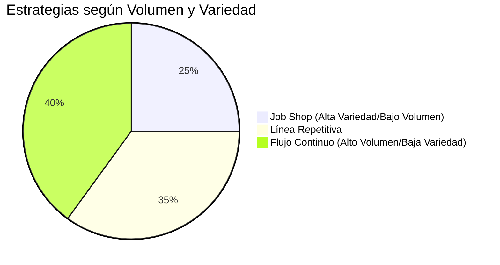
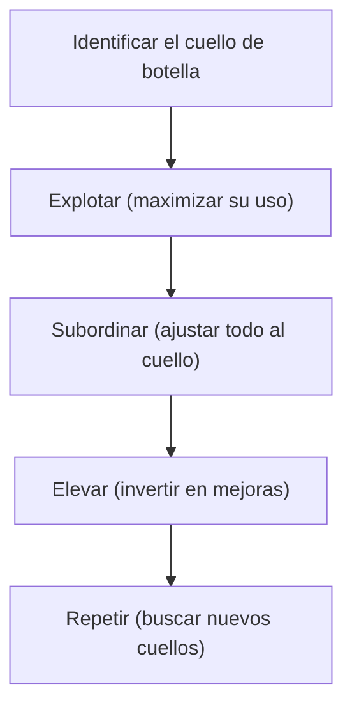
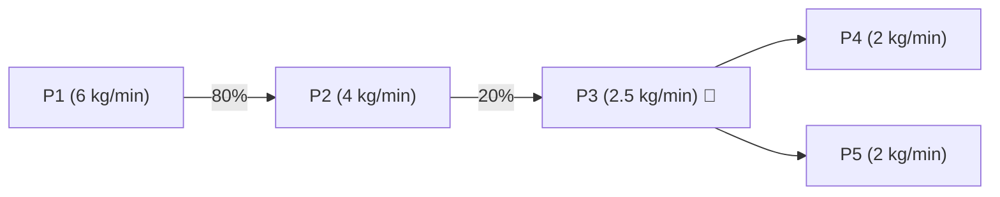

# **Clase 03: Estrategias de Procesos y Teoría de Restricciones**

**Enfoque en Modelado y Optimización**

---

## **📌 Introducción**

Los procesos productivos pueden organizarse de múltiples formas, cada una con ventajas y desventajas según **volumen** y **variedad**. Hoy exploraremos:  
✅ **Estrategias de procesos** (Job Shop vs. Flujo Continuo)  
✅ **Teoría de Restricciones (TOC)**  
✅ **Planificación con múltiples SKUs**

> **💡 Concepto clave**: _"La estrategia de proceso debe alinearse con la estrategia competitiva de la empresa."_

---

## **📊 Estrategias de Procesos**

### **🔹 Comparación: Enfoque al Proceso vs. Producto**

### **🔹 Tabla Comparativa**

| **Característica**      | **Enfoque al Proceso (Job Shop)** | **Enfoque al Producto (Flujo Continuo)** |
| ----------------------- | --------------------------------- | ---------------------------------------- |
| **Flexibilidad**        | Alta (productos personalizados)   | Baja (productos estandarizados)          |
| **Inversión Inicial**   | Baja (equipos genéricos)          | Alta (automatización)                    |
| **Utilización Equipos** | 5%-25%                            | 70%-90%                                  |
| **Ejemplo**             | Taller de carpintería             | Refinería de petróleo                    |

**📌 Conclusión**:

- **Job Shop** → Ideal para **pedidos especializados** (ej: muebles a medida).
- **Flujo Continuo** → Ideal para **producción masiva** (ej: bebidas embotelladas).

---

## **⚡ Teoría de Restricciones (TOC)**

### **🔹 Los 5 Pasos de Goldratt**

### **🔹 Ejemplo Práctico**

**Proceso**:

**Análisis**:

- **Cuello de botella**: P3 (2.5 kg/min).
- **Acciones**:
  1. **Proteger**: Añadir buffer antes de P3.
  2. **Subordinar**: Limitar entrada a 2.5 kg/min.
  3. **Elevar**: Comprar una máquina adicional para P3.

---

## **📈 Planificación con Múltiples SKUs**

### **🔹 Datos de Producción (8h/día)**

| **SKU** | **TAKT Time (seg/un)** | **Margen ($/un)** | **Demanda (un)** | **Margen/Cuello ($/seg)** |
| ------- | ---------------------- | ----------------- | ---------------- | ------------------------- |
| SKU 1   | 20                     | 13                | 540              | 0.65                      |
| SKU 2   | 10                     | 6                 | 1080             | 0.60                      |
| SKU 3   | 12                     | 10                | 1200             | **0.83** 🏆               |
| SKU 4   | 15                     | 11                | 480              | 0.73                      |
| SKU 5   | 18                     | 12                | 600              | 0.67                      |

### **🔹 Priorización Óptima**

1. **SKU 3** (Mayor margen en el cuello de botella).
2. **SKU 4**
3. **SKU 5**

```mermaid
gantt
    title Plan Diario (8h)
    dateFormat HH:mm
    axisFormat %H:%M
    section Producción
    SKU 3 :a1, 08:00, 4h
    SKU 4 :a2, after a1, 2h
    SKU 5 :a3, after a2, 2h
```

**Resultado**: **$22,080** de utilidad (vs.$19,500 priorizando solo margen).

---

## **📌 Conclusiones**

✔ La **estrategia de proceso** debe elegirse según **volumen y variedad**.  
✔ La **TOC** enseña a gestionar cuellos de botella sistemáticamente.  
✔ En **producción múltiple**, priorizar por **margen/cuello** maximiza utilidades.

**🔍 Recursos Adicionales**:

- Libro: _"La Meta"_ (Eliyahu Goldratt) - Casos reales de TOC.
- Software: **Simuladores de flujo** (AnyLogic, FlexSim).
- Video: **"Cómo Toyota aplica TOC"** (YouTube).

---

**🏆 Ejercicio Propuesto**:  
Una fábrica tiene 3 SKUs con los siguientes datos:

| **SKU** | **TAKT Time** | **Margen** | **Demanda** |
| ------- | ------------- | ---------- | ----------- |
| A       | 15 seg        | $8         | 600 un      |
| B       | 20 seg        | $12        | 400 un      |
| C       | 10 seg        | $5         | 800 un      |

**Pregunta**: ¿Cuál es la secuencia óptima para 8h de trabajo?  
_(Solución: Calcular margen/seg y priorizar)_.
