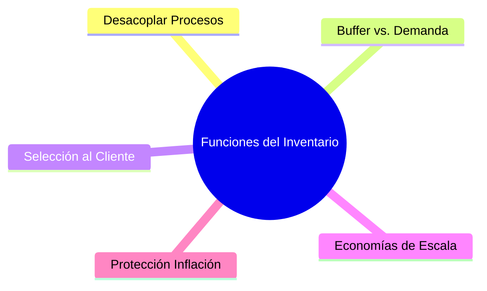
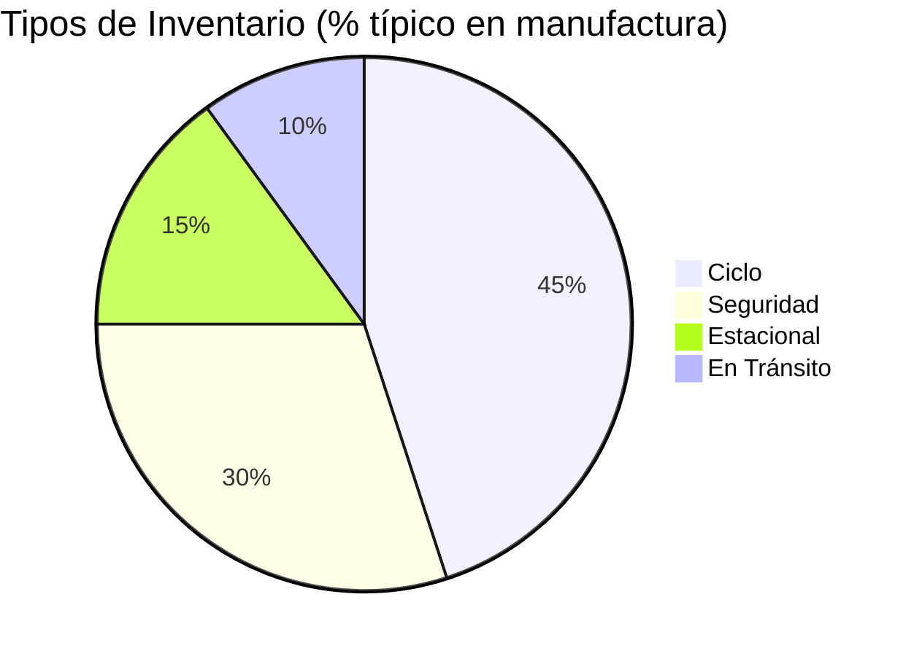
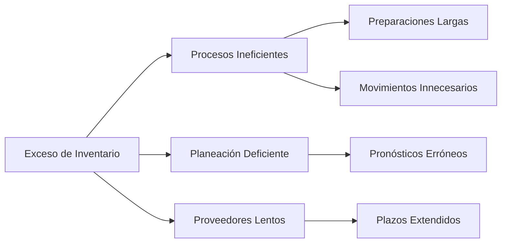
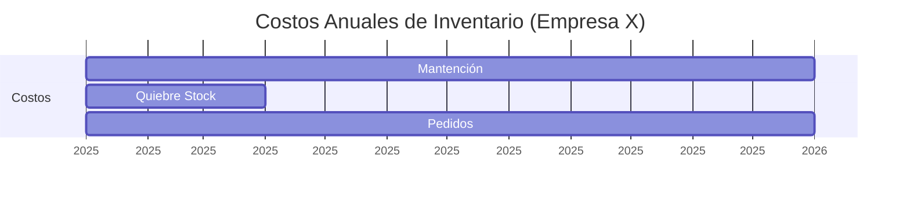

# **Clase 04: Gestión de Inventarios Determinísticos**

**Fundamentos y Modelos Clave**

---

## **📌 Introducción**

Los inventarios son como el "colchón financiero" de las operaciones: **demasiado poco** genera quiebres de stock, **demasiado mucho** encarece los costos. Hoy exploraremos:  
✅ **Funciones y tipos de inventario**  
✅ **Costos asociados**  
✅ **Problemas ocultos**

> **💡 Concepto clave**: _"El inventario óptimo equilibra disponibilidad y costo."_

---

## **📊 Funciones del Inventario**

### **🔹 Diagrama de Roles**

### **🔹 Tabla de Beneficios**

| **Función**                | **Ejemplo**                          | **Impacto**                 |
| -------------------------- | ------------------------------------ | --------------------------- |
| **Desacoplar procesos**    | Evitar paros por falta de materiales | Mantiene producción estable |
| **Buffer de demanda**      | Stock en temporada alta              | Evita perder ventas         |
| **Descuentos por volumen** | Compra masiva de materias primas     | Reduce costo unitario       |

---

## **📦 Tipos de Inventario**

### **🔹 Clasificación Visual**

### **🔹 Características**

| **Tipo**        | **Propósito**                         | **Ejemplo**                      |
| --------------- | ------------------------------------- | -------------------------------- |
| **Ciclo**       | Cubrir demanda entre pedidos          | Lotes de producción mensual      |
| **Seguridad**   | Absorber variabilidad demanda/entrega | Stock extra por huelga portuaria |
| **Estacional**  | Anticipar picos estacionales          | Juguetes en Navidad              |
| **En Tránsito** | Materiales en transporte              | Contenedores en importación      |

---

## **⚠️ Problemas Ocultos**

### **🔹 Diagrama de Ishikawa (Espina de Pescado)**

### **🔹 Caso Real: Retail**

- **Síntoma**: Bodegas llenas de productos obsoletos.
- **Causa raíz**:
  - Compras agresivas por descuentos.
  - Sistema de pronóstico desactualizado.
- **Solución**: Implementar modelo **JIT (Just-in-Time)**.

---

## **💸 Costos Asociados**

### **🔹 Estructura de Costos**

| **Costo**            | **Descripción**                          | **Fórmula**                |
| -------------------- | ---------------------------------------- | -------------------------- |
| **Mantención**       | Almacenaje + Obsolescencia               | 25%-35% del valor anual    |
| **Quiebre de Stock** | Ventas perdidas + Clientes insatisfechos | Costo oportunidad + Multas |
| **Pedido**           | Emisión y procesamiento de órdenes       | $50-$500 por orden         |

### **🔹 Ejemplo Numérico**

---

## **📌 Conclusiones**

✔ El inventario **no es un mal necesario**, es una **herramienta estratégica**.  
✔ Los "excesos" suelen esconder **ineficiencias operativas**.  
✔ El modelo **EOQ (Lote Económico)** ayuda a optimizar costos (próxima clase).

**🔍 Recursos Adicionales**:

- Libro: **Capítulo 17** de _"Administración de Operaciones"_ (Chase).
- Video: **"Cómo Zara gestiona inventarios"** (YouTube).
- Herramienta: **Plantilla EOQ en Excel** (disponible en Canvas).

---

**🏆 Ejercicio Propuesto**:  
Una empresa tiene:

- Demanda anual: **10,000 unidades**.
- Costo por pedido: **$150**.
- Costo de mantención: **$2/unidad/año**.

**Pregunta**: Calcule el **EOQ** y el **costo total anual**.  
(Solución:$\text{EOQ} = \sqrt{\frac{2DS}{H}} = \sqrt{\frac{2 \times 10{,}000 \times 150}{2}} = 1{,}225 \text{ unidades}; \text{Costo} = \$2{,}450$)
