# **Clase 04: Gestión de Inventarios Determinísticos**

**Fundamentos y Modelos Clave**

---

## **📌 Introducción**

Los inventarios son como el "colchón financiero" de las operaciones: **demasiado poco** genera quiebres de stock, **demasiado mucho** encarece los costos. Hoy exploraremos:  
✅ **Funciones y tipos de inventario**  
✅ **Costos asociados**  
✅ **Problemas ocultos**

> **💡 Concepto clave**: _"El inventario óptimo equilibra disponibilidad y costo."_

---

## **📊 Funciones del Inventario**

### **🔹 Diagrama de Roles**

```mermaid
mindmap
  root((Funciones del Inventario))
    Desacoplar Procesos
    Buffer vs. Demanda
    Selección al Cliente
    Economías de Escala
    Protección Inflación
```

### **🔹 Tabla de Beneficios**

| **Función**                | **Ejemplo**                          | **Impacto**                 |
| -------------------------- | ------------------------------------ | --------------------------- |
| **Desacoplar procesos**    | Evitar paros por falta de materiales | Mantiene producción estable |
| **Buffer de demanda**      | Stock en temporada alta              | Evita perder ventas         |
| **Descuentos por volumen** | Compra masiva de materias primas     | Reduce costo unitario       |

---

## **📦 Tipos de Inventario**

### **🔹 Clasificación Visual**

```mermaid
pie
    title Tipos de Inv (% típico en manufactura)
    "Ciclo" : 45
    "Seguridad" : 30
    "Estacional" : 15
    "En Tránsito" : 10
```

### **🔹 Características**

| **Tipo**        | **Propósito**                         | **Ejemplo**                      |
| --------------- | ------------------------------------- | -------------------------------- |
| **Ciclo**       | Cubrir demanda entre pedidos          | Lotes de producción mensual      |
| **Seguridad**   | Absorber variabilidad demanda/entrega | Stock extra por huelga portuaria |
| **Estacional**  | Anticipar picos estacionales          | Juguetes en Navidad              |
| **En Tránsito** | Materiales en transporte              | Contenedores en importación      |

---

## **⚠️ Problemas Ocultos**

### **🔹 Diagrama de Ishikawa (Espina de Pescado)**

```mermaid
graph LR
    A[Exceso de Inventario] --> B[Procesos Ineficientes]
    A --> C[Planeación Deficiente]
    A --> D[Proveedores Lentos]
    B --> B1[Preparaciones Largas]
    B --> B2[Movimientos Innecesarios]
    C --> C1[Pronósticos Erróneos]
    D --> D1[Plazos Extendidos]
```

---

## **📌 Conclusiones**

✔ El inventario **no es un mal necesario**, es una **herramienta estratégica**.  
✔ Los "excesos" suelen esconder **ineficiencias operativas**.  
✔ El modelo **EOQ (Lote Económico)** ayuda a optimizar costos (próxima clase).

**🔍 Recursos Adicionales**:

- Libro: **Capítulo 17** de _"Administración de Operaciones"_ (Chase).
- Video: **"Cómo Zara gestiona inventarios"** (YouTube).
- Herramienta: **Plantilla EOQ en Excel** (disponible en Canvas).

---

**🏆 Ejercicio Propuesto**:  
Una empresa tiene:

- Demanda anual: **10,000 unidades**.
- Costo por pedido: **$150**.
- Costo de mantención: **$2/unidad/año**.

**Pregunta**: Calcule el **EOQ** y el **costo total anual**.  
Solución:

$$\text{EOQ} = \sqrt{\frac{2DS}{H}} = \sqrt{\frac{2 \times 10{,}000 \times 150}{2}} = 1{,}225 \text{ unidades}; \text{Costo} = \$2{,}450$$
