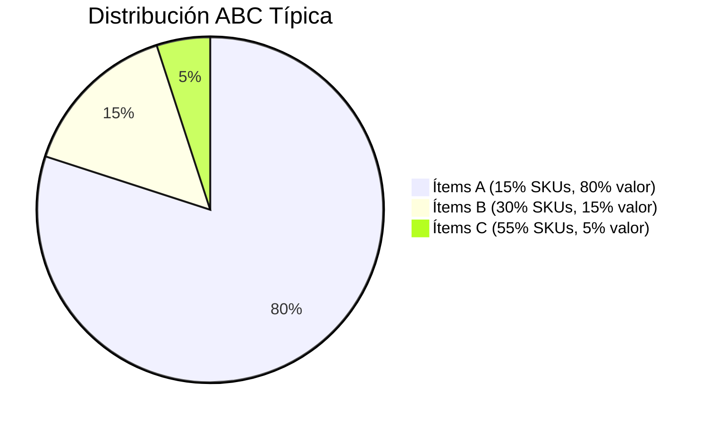

# **Clase 05: Modelos de Inventarios Determinísticos**

**EOQ, Análisis ABC y Gestión Multi-Producto**

---

## **📌 Introducción**

La gestión óptima de inventarios es como **regular el flujo de agua en una represa**: demasiado genera costos, muy poco causa escasez. Hoy aprenderemos:  
✅ **Análisis ABC** para priorización  
✅ **Modelo EOQ (Lote Económico)**  
✅ **Gestión de múltiples productos**

> **💡 Concepto clave**: _"El inventario es dinero convertido en productos; debemos minimizarlo sin afectar el servicio."_

---

## **📊 Análisis ABC: Clasificación de Inventarios**

### **🔹 Diagrama de Pareto**

### **🔹 Estrategias por Categoría**

| **Categoría** | **Gestión Recomendada**  | **Ejemplo de Política**         |
| ------------- | ------------------------ | ------------------------------- |
| **A**         | Revisión continua (s,Q)  | Pedidos automáticos con EOQ     |
| **B**         | Revisión periódica (T,Q) | Órdenes mensuales con ajuste    |
| **C**         | Pedidos consolidados     | Compras semestrales por volumen |

**📌 Caso Real**: _Walmart usa análisis ABC para priorizar reposición en tiendas (los ítems A tienen stock diario, los C se reponen semanalmente)._

---

## **⚡ Modelo EOQ (Lote Económico)**

### **🔹 Fórmulas Clave**

$$
Q^* = \sqrt{\frac{2DS}{H}} \quad \text{(Cantidad óptima)}
$$

$$

C_T = \frac{DS}{Q} + \frac{HQ}{2} + PD \quad \text{(Costo total anual)}
$$

### **🔹 Ejemplo Numérico**

```mermaid
gantt
  title Ejemplo EOQ (D=1000 un, S=$100, H=$5)
  dateFormat  X
  axisFormat %s
  section Costos
  Pedido :a1, 0, 500
  Mantención :a2, 0, 500
  section Órdenes
  Orden 1 :a3, 0, 200
  Orden 2 :a4, 200, 200
  Orden 3 :a5, 400, 200
```

**Resultado**:

-$Q^* = 200$unidades

- Costo total =$1,000 (pedido) +$500 (mantención) = **$1,500**

---

## **📈 Punto de Reorden (ROP)**

### **🔹 Cálculo Básico**

$$
ROP = d \times T_s \quad \text{(Demanda diaria × Tiempo de entrega)}
$$

**Ejemplo**:

-$D = 1000 \text{ un/año}$→$d = 4 \text{ un/día}$ -$T_s = 10 \text{ días}$→$ROP = 40 \text{ un}$

### **🔹 Caso$T_s > T_c$**

$$

ROP = d \times \left(T_s - \left\lfloor \frac{T_s}{T_c} \right\rfloor \times T_c \right)
$$

**Ejemplo**:

-$T_s = 60 \text{ días}, T_c = 50 \text{ días}$→$ROP = 40 \text{ un}$

---

## **🔄 Gestión de Múltiples Productos**

### **🔹 Modelo con Restricción de Espacio**

$$
\text{Minimizar } C_T = \sum_{i=1}^n \left(\frac{S_i D_i}{Q_i} + \frac{H_i Q_i}{2}\right)
$$

$$

\text{Sujeto a } \sum_{i=1}^n Q_i v_i \leq A \quad \text{(A = espacio disponible)}
$$

### **🔹 Ejemplo Práctico**

| **Producto** | **Demanda (D)** | **Costo Pedido (S)** | **Volumen (v)** |
| ------------ | --------------- | -------------------- | --------------- |
| X            | 500             | $50                  | 0.5 m³          |
| Y            | 300             | $30                  | 0.3 m³          |

**Solución**: Usar **multiplicadores de Lagrange** para optimizar$Q_X$y$Q_Y$dentro de$A = 100 \text{ m³}$.

---

## **📌 Conclusiones**

✔ **EOQ** equilibra costos de pedido y mantención.
✔ **ROP** asegura stock durante el tiempo de entrega.
✔ **ABC** prioriza recursos en ítems críticos.

**🔍 Recursos Adicionales**:

- Libro: **Capítulo 17** de _"Administración de Operaciones"_ (Chase).
- Calculadora EOQ: [Plantilla Excel en Canvas](link).
- Video: **"Cómo Amazon aplica EOQ"** (YouTube).

---

**🏆 Ejercicio Propuesto**:
Una empresa tiene:

-$D = 2000 \text{ un/año}$,$S = \$75$,$H = \$3 \text{ un/año}$. -$T_s = 15 \text{ días}$, año laboral = 250 días.

**Preguntas**:

1. Calcule$Q^*$y$C_T$.
2. Determine el ROP.

_(Solución:$Q^* = 316 \text{ un}, C_T = \$949, ROP = 120 \text{ un}$)_.
