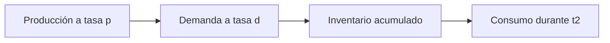
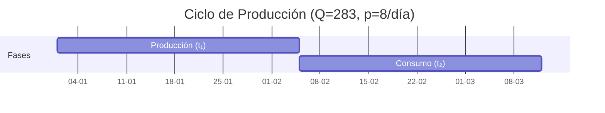

# **Clase 06: Modelos Avanzados de Inventarios Determinísticos**

**EOQ con Producción Continua, Descuentos y Faltantes**

---

## **🎯 Introducción**

Gestionar inventarios es como **conducir un automóvil**: necesitas acelerar (producir) y frenar (detener producción) en el momento justo para mantener la velocidad óptima (nivel de stock). Hoy exploraremos:  
✅ **EOQ con entrega continua** (modelo de producción)  
✅ **Gestión de faltantes planificados**  
✅ **Descuentos por volumen**

> **💡 Dato clave**: _El modelo EOQ de producción reduce costos cuando la recepción de mercancía es gradual (ej: fábricas que producen y venden simultáneamente)._

---

## **📊 EOQ con Entrega Continua (Modelo de Producción)**

### **🔹 ¿Cómo funciona?**

### **🔹 Fórmulas Clave**

$$
Q^\* = \sqrt{\frac{2DS}{H \left(1 - \frac{d}{p}\right)}}
$$

$$

t₁ = \frac{Q}{p}, \quad t₂ = \frac{Q}{d} - \frac{Q}{p}
$$

**Ejemplo**:

-$D = 1000 \text{ un/año}$($d = 4 \text{ un/día}$) -$p = 8 \text{ un/día}$,$S = \$100$,$H = \$5$

$$
Q^\* = \sqrt{\frac{2 \times 1000 \times 100}{5 \left(1 - \frac{4}{8}\right)}} = 283 \text{ unidades}
$$

---

## **⚠️ Punto de Reorden (ROP) en Producción Continua**

### **🔹 Casos Clave**

| **Condición**       | **Fórmula ROP**            | **Ejemplo (Tₛ = 10 días)**                                |
| ------------------- | -------------------------- | --------------------------------------------------------- |
| $T_s \leq t₂$       | $ROP = T_s \times d$       | $10 \times 4 = 40 \text{ un}$                             |
| $t₂ < T_s \leq T_c$ | $ROP = (T_c - T_s)(p - d)$ | Si$T_c = 50 \text{ días}$:$(50-10)(8-4) = 160 \text{ un}$ |

---

## **📦 EOQ con Faltantes Planificados**

### **🔹 Estructura de Costos**

$$

C*T = \underbrace{\frac{(Q - Q_f)^2}{2Q}H}*{\text{Mantención}} + \underbrace{\frac{Q*f^2}{2Q}B}*{\text{Faltantes}} + \underbrace{\frac{D}{Q}S}\_{\text{Pedido}}
$$

**Donde**:

-$Q_f$: Unidades faltantes permitidas -$B$: Costo anual por faltante

### **🔹 Solución Óptima**

$$
Q^* = \sqrt{\frac{2DS}{H}} \times \sqrt{\frac{H + B}{B}}
$$

$$

Q\*f^\* = Q^\_ \times \frac{H}{H + B}
$$

**Ejemplo**:  
Si$B = \$20$:

$$
Q^_ = 200 \times \sqrt{\frac{5+20}{20}} = 224 \text{ un}, \quad Q_f^_ = 45 \text{ un}
$$

---

## **💸 EOQ con Descuentos por Volumen**

### **🔹 Tipos de Descuentos**

| **Tipo**     | **Característica**                           | **Ejemplo**                  |
| ------------ | -------------------------------------------- | ---------------------------- |
| **Uniforme** | Descuento aplica a todas las unidades        | 3% si$Q \geq 300$            |
| **Gradual**  | Descuento aplica solo a unidades adicionales | 2% en 100-199 un, 3% en 200+ |

### **🔹 Metodología de Cálculo**

1. Calcular$Q^\*$para cada tramo.
2. Ajustar$Q$si está fuera del rango del tramo.
3. Evaluar costo total ($C_T$) en cada punto de quiebre.

**Ejemplo (Uniforme)**:
| **Tramo** | **Q** | **Costo Unitario** |$C_T$|
|-----------|---------|--------------------|-----------------|
| 1 (0-99) | 200 → 99 | \$500 | \$501,258 |
| 2 (100-299)| 202 | \$490 | **\$490,989** 🏆|
| 3 (300+) | 203 | \$485 | \$486,061 |

---

## **📌 Conclusiones**

✔ El **EOQ de producción** optimiza inventarios cuando la recepción es gradual.
✔ Los **faltantes planificados** pueden reducir costos totales si$B$es alto.
✔ Los **descuentos** requieren comparar$C_T$en puntos de quiebre.

**🔍 Recursos Adicionales**:

- Calculadora interactiva EOQ: [Tools4SupplyChain](https://www.tools4supplychain.com)
- Video: **"EOQ en la industria automotriz"** (YouTube)

---

**🏆 Ejercicio Propuesto**:
Una fábrica tiene:

-$D = 2000 \text{ un/año}$,$p = 20 \text{ un/día}$,$d = 8 \text{ un/día}$ -$S = \$50$,$H = \$2$,$B = \$15$

**Preguntas**:

1. Calcule$Q^_$y$Q_f^_$con faltantes.
2. Determine el ROP si$T_s = 5 \text{ días}$.

_(Solución:$Q^* = 224 \text{ un}, Q_f^* = 28 \text{ un}, ROP = 40 \text{ un}$)_.

$$
$$
