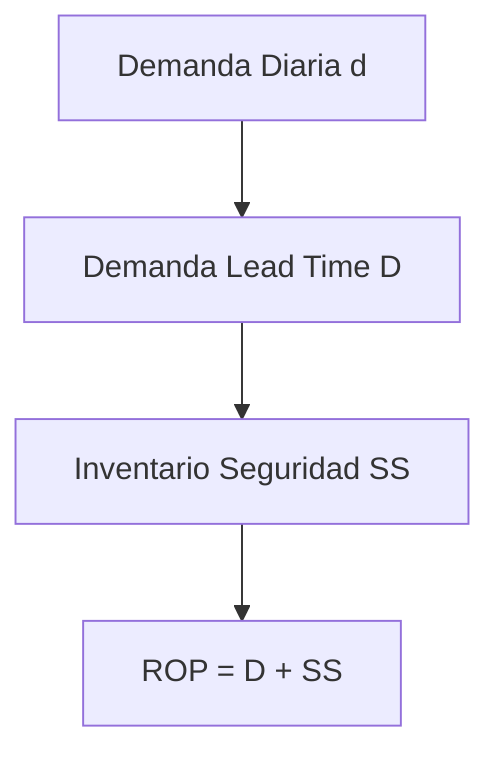

# **Clase 07: Gestión de Inventarios con Demanda Variable**

**Modelos Probabilísticos y Niveles de Servicio**

---

## **🎯 Introducción**

Imagina que eres un **director de orquesta**: debes anticipar cuántos músicos (stock) necesitarás para el concierto (demanda), aunque algunos puedan faltar (variabilidad). Hoy aprenderemos a:  
✅ Calcular **inventario de seguridad** para cubrir fluctuaciones  
✅ Usar distribuciones probabilísticas para gestionar riesgos  
✅ Aplicar modelos de revisión periódica y continua

> **💡 Dato clave**: _El 95% de las empresas retail usan modelos probabilísticos para gestionar inventarios estacionales (Fuente: Council of Supply Chain Management)._

---

## **📊 Modelo Probabilístico Básico**

### **🔹 Componentes Clave**

### **🔹 Fórmulas Esenciales**

$$
SS = Z \times \sigma_L \quad \text{(Z según nivel de servicio)}
$$

$$
ROP = \underbrace{d \times L}_{\text{Demanda esperada}} + SS
$$

**Ejemplo**:

-$d \sim N(60, 7^2)$,$L = 6$días, NS=95% ($Z=1.65$)

$$
 \sigma_L = 7 \times \sqrt{6} = 17.14
$$

$$
 SS = 1.65 \times 17.14 = 28.3 \approx 29 \text{ unidades}
$$

$$
 ROP = 60 \times 6 + 29 = 389 \text{ unidades}
$$

---

## **📈 Niveles de Servicio y Z**

### **🔹 Tabla de Valores Z**

| **Nivel de Servicio** | **Z** | **Riesgo de Quiebre** |
| --------------------- | ----- | --------------------- |
| 90%                   | 1.28  | 10%                   |
| 95%                   | 1.65  | 5%                    |
| 99%                   | 2.33  | 1%                    |

### **🔹 Impacto en SS**

| **Nivel de Servicio** | **Inventario de Seguridad (SS)** |
| --------------------- | -------------------------------- |
| 90%                   | 22 unidades                      |
| 95%                   | 29 unidades                      |
| 99%                   | 40 unidades                      |

**Conclusión**: A mayor nivel de servicio, mayor SS requerido (relación no lineal).

---

## **⚠️ Modelos Avanzados**

### **🔹 Lead Time Variable**

$$
ROP = d \times E[L] + Z \times d \times \sigma_L
$$

**Ejemplo**:

-$L \sim N(6, 1^2)$,$d = 60$:

$$
 ROP = 60 \times 6 + 1.65 \times 60 \times 1 = 360 + 99 = 459 \text{ unidades}
$$

### **🔹 Revisión Periódica (T,Q)**

$$
Q = d \times (T + L) + Z \times \sigma \times \sqrt{T + L} - I_{\text{actual}}
$$

**Caso**: Revisión cada 10 días,$I*{\text{actual}} = 150$:

$$
Q = 60 \times (10 + 6) + 1.65 \times 7 \times \sqrt{16} - 150 = 960 + 46 - 150 = 856 \text{ unidades}
$$

---

## **📌 Ejemplo Integrado**

### **🔹 Datos**

- Demanda anual:$21,900$($\mu_d = 60$,$\sigma_d = 7$) -$L = 6$días,$S = \$10$,$H = \$0.50$
- NS = 95% ($Z = 1.65$)

### **🔹 Solución**

1. **EOQ**:
   $$
   Q^\* = \sqrt{\frac{2 \times 21900 \times 10}{0.5}} = 936 \text{ unidades}
   $$
   $$
2. **ROP**:
   $$
   ROP = 360 + 28 = 388 \text{ unidades}
   $$
   $$

---

## **📝 Conclusiones**

✔ El **inventario de seguridad** protege contra variabilidad (demanda/lead time).  
✔ Los **niveles de servicio** altos incrementan SS exponencialmente.  
✔ La **revisión periódica** es útil para ítems de bajo valor (Ej: repuestos).

**🔍 Recursos Adicionales**:

- Libro: **Capítulo 17** de _"Administración de Operaciones"_ (Chase).
- Herramienta: [Calculadora SS en Excel](https://www.supplychaindata.com/tools).

---

**🏆 Ejercicio Propuesto**:  
Una tienda tiene:

-$d \sim N(100, 10^2)$,$L = 4$días, NS=99%. -$S = \$20$,$H = \$1$.

**Preguntas**:

1. Calcule SS y ROP.
2. Determine EOQ.

_(Solución:$SS = 52 \text{ un}, ROP = 452 \text{ un}, Q^* = 628 \text{ un}$)_.
