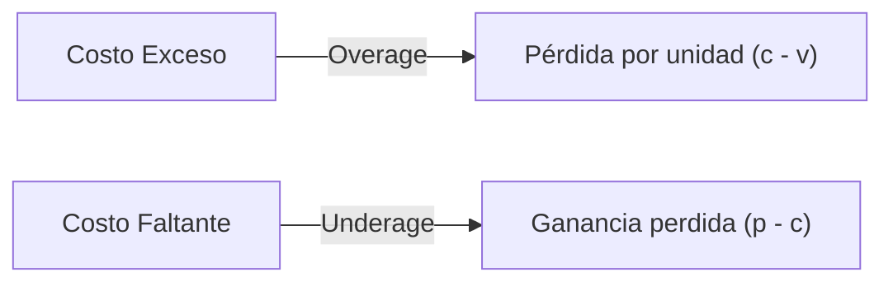
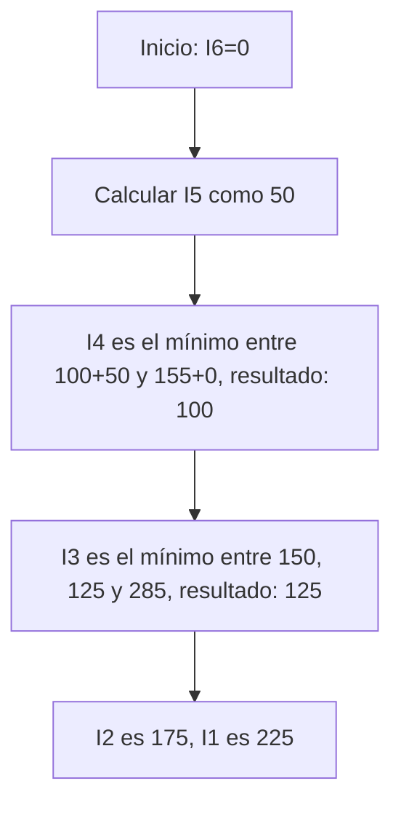

# **Clase 08: Modelos Avanzados de Inventarios**

**Perecibles, Multiperíodo y Optimización Dinámica**

---

## **🎯 Introducción**

Gestionar inventarios con demanda variable es como **preparar un menú diario**: debes balancear ingredientes frescos (perecibles) con pedidos futuros, evitando sobras (exceso) o faltantes (pérdida de ventas). Hoy cubriremos:  
✅ **Modelo Newsvendor** para productos perecederos  
✅ **Planificación multiperíodo** (Wagner-Whitin)  
✅ **Heurísticas vs. Optimización exacta**

> **💡 Dato clave**: _El 60% de los retailers usan modelos tipo Newsvendor para moda y perecederos (Journal of Operations Management)._

---

## **📊 Modelo Newsvendor (Productos Perecederos)**

### **🔹 Costos Clave**

### **🔹 Fórmula de Cantidad Óptima**

$$
Q^* = F^{-1}\left(\frac{C_u}{C_u + C_o}\right)
$$

**Ejemplo (Chalecos)**:

- $p = \$180$, $c = \$110$, $v = \$90$
- $C_u = 180-110 = 70$, $C_o = 110-90 = 20$

- Razón crítica = $\frac{70}{70+20} = 0.7778$
- Si $D \sim N(100, 15^2)$:
  $$
  Q^* = 100 + 0.76 \times 15 \approx 111 \text{ unidades}
  $$

---

## **📈 Planificación Multiperíodo (Wagner-Whitin)**

### **🔹 Tabla de Demanda y Costos**

| Período (t)           | 1     | 2     | 3     | 4     | 5     |
| --------------------- | ----- | ----- | ----- | ----- | ----- |
| Demanda (dₜ)          | 100   | 100   | 50    | 50    | 210   |
| Costo Orden (Sₜ)      | \$50  | \$50  | \$50  | \$50  | \$50  |
| Costo Mantención (Hₜ) | \$0.5 | \$0.5 | \$0.5 | \$0.5 | \$0.5 |

### **🔹 Algoritmo Paso a Paso**

**Solución Óptima**:

- **Órdenes en t=1 (300u) y t=5 (210u)**
- **Costo Total = \$225**

---

## **⚡ Comparación: Heurísticas vs. Wagner-Whitin**

### **🔹 Resultados Comparativos**

| Método                   | Costo Total | Órdenes Generadas                  |
| ------------------------ | ----------- | ---------------------------------- |
| **Silver-Meal**          | \$275       | t=1 (200u), t=3 (100u), t=5 (210u) |
| **Lote Económico (EOQ)** | \$645       | t=1 (500u)                         |
| **Wagner-Whitin**        | **\$225**   | t=1 (300u), t=5 (210u)             |

**Conclusión**: WW reduce costos en **18%** vs. heurísticas.

---

## **📌 Ejemplo Integrado: Retail de Alimentos**

### **🔹 Datos**

- Producto: Leche fresca ($D \sim N(120, 20^2)$)
- $p = \$5$, $c = \$3$, $v = \$1$
- NS = 95% ($Z = 1.65$)

### **🔹 Solución**

1. **Newsvendor**:
   $$
   Q^* = 120 + 1.65 \times 20 \approx 153 \text{ unidades}
   $$
2. **ROP con SS**:
   $$
   SS = 1.65 \times 20 = 33 \text{ unidades}
   $$

---

## **📝 Conclusiones**

✔ **Newsvendor** es ideal para perecederos con demanda incierta.  
✔ **Wagner-Whitin** optimiza costos en planificación multiperíodo.  
✔ Las heurísticas son simples pero menos precisas.

**🔍 Recursos Adicionales**:

- Libro: **Capítulo 17** de _"Administración de Operaciones"_ (Chase).
- Herramienta: [Calculadora WW en Python](https://github.com/supplychainwizard/Wagner-Whitin).

---

**🏆 Ejercicio Propuesto**:  
Un supermercado tiene:

- $D \sim N(200, 30^2)$, $p = \$8$, $c = \$4$, $v = \$2$.

- Períodos: 3 meses con demanda [150, 300, 250].

**Preguntas**:

1. Calcule $Q^*$ con Newsvendor (NS=90%).
2. Optimice órdenes con WW ($S = \$60$,$H = \$0.8$).

Solución:

1. $Q^* = 238 \text{ un}$,
2. Órdenes en $t=1 (450u)$ y $t=3 (250u)$, Costo= $\$348$.

---
