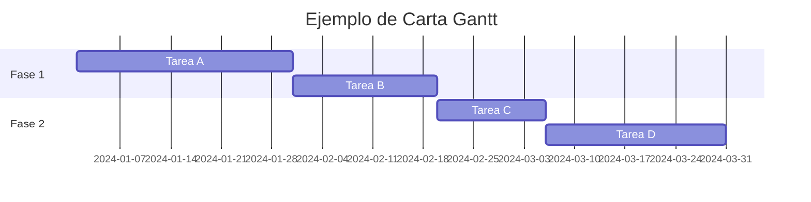
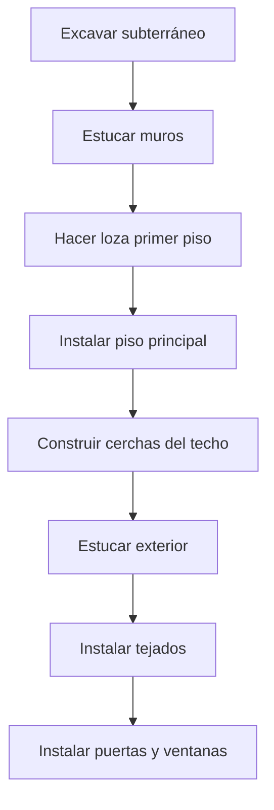

# Clase 2: Administración de Proyectos

## 🎯 Introducción

Imagina que estás organizando una boda - un evento que requiere coordinar múltiples actividades, desde elegir la fecha y el lugar hasta gestionar proveedores y presupuestos. La administración de proyectos es exactamente eso pero aplicado al mundo profesional: la organización sistemática de recursos, tiempo y esfuerzos para alcanzar un objetivo específico.

### ¿Qué es la Administración de Proyectos?

La administración de proyectos es la planificación, dirección y control de recursos (mano de obra, equipamiento, insumos) bajo restricciones técnicas, de costo y de tiempo para lograr objetivos específicos.

- **Enfoque sistemático para gestionar actividades relacionadas**: Esto implica desglosar el proyecto en tareas manejables y asignar recursos de manera eficiente. Un enfoque sistemático permite una mejor organización y seguimiento del progreso del proyecto.
- **Coordinación de múltiples recursos y stakeholders**: Involucra la comunicación y colaboración entre diferentes partes interesadas, asegurando que todos estén alineados con los objetivos del proyecto. La coordinación efectiva es crucial para evitar malentendidos y retrasos.
- **Balance entre tiempo, costo y calidad**: Es crucial encontrar un equilibrio entre estos tres factores, ya que mejorar uno puede afectar negativamente a los otros. Por ejemplo, reducir el tiempo de entrega puede aumentar los costos o disminuir la calidad del producto final.

> 💡 **Dato importante**: El proyecto de rediseño del Ford Mustang, con un equipo de 450 miembros y un costo de US$700 millones, fue 25% más rápido y 30% más barato que proyectos comparables gracias a una efectiva gestión de proyectos.

## 📊 Conceptos Principales

### Ciclo de Vida del Proyecto

El ciclo de vida de un proyecto se divide en varias fases, cada una con sus propias actividades y objetivos:

1. **Concepto**: Identificación de la necesidad del proyecto y definición de los objetivos generales. Esta fase incluye la elaboración de una idea inicial y la evaluación de su viabilidad.
2. **Análisis de factibilidad**: Evaluación de costos, beneficios y riesgos para determinar si el proyecto es viable. Se realiza un estudio detallado para asegurar que el proyecto puede ser llevado a cabo con éxito.
3. **Planificación**: Definición de responsabilidades, tiempos y recursos necesarios para alcanzar los objetivos. Se elabora un plan detallado que incluye cronogramas, presupuestos y asignación de tareas.
4. **Ejecución**: Implementación del proyecto, donde se llevan a cabo las actividades planificadas. Durante esta fase, se monitorea el progreso y se realizan ajustes según sea necesario.
5. **Término**: Cierre y evaluación final del proyecto, incluyendo la entrega de resultados y la revisión de lecciones aprendidas. Se documentan los logros y se analizan las áreas de mejora para futuros proyectos.

### Métodos de Planificación

#### Cartas Gantt

Desarrolladas por Henry L. Gantt durante la Primera Guerra Mundial, son gráficos de barras que muestran la secuencia y duración de actividades. Son útiles para visualizar el cronograma del proyecto y el progreso de cada tarea. Las cartas Gantt permiten identificar fácilmente las tareas críticas y las dependencias entre ellas.

#### Métodos de Redes (CPM/PERT)

- **CPM (Critical Path Method)**: Para proyectos con tiempos determinísticos. Identifica la secuencia de actividades críticas que determinan la duración total del proyecto. El CPM ayuda a identificar las tareas que no pueden retrasarse sin afectar la fecha de finalización del proyecto.
- **PERT (Program Evaluation and Review Technique)**: Para proyectos con incertidumbre temporal. Utiliza estimaciones optimistas, más probables y pesimistas para calcular el tiempo esperado de cada actividad. El PERT es útil para proyectos donde los tiempos de las actividades no son conocidos con certeza.

## 💻 Herramientas y Recursos

### Software de Gestión de Proyectos

1. **Microsoft Project**

   - Ideal para proyectos medianos
   - Excelente para gestión de recursos y costos
   - Reportes de alta calidad

2. **Primavera Project Planner**

   - Para proyectos grandes o programas múltiples
   - Usado en proyectos complejos como Petronas Towers

3. **Software Open Source**
   - OpenProject: Mejor opción general
   - GanttProject: Más fácil de usar
   - Tuleap: Especializado en DevOps

## 📈 Aplicaciones Prácticas

### Caso 1: Proyecto de Construcción

Ejemplo de aplicación de CPM en un proyecto de construcción residencial:

### Caso 2: Desarrollo de Software

Aplicación de PERT en un proyecto de software con estimaciones de tiempo:

$$ Tiempo\_{esperado} = \frac{a + 4m + b}{6} $$
Donde:

- $a$ = tiempo optimista
- $m$ = tiempo más probable
- $b$ = tiempo pesimista

## 🎓 Ejercicio Práctico

### Cálculo de Ruta Crítica y Probabilidad de Término

Consideremos un proyecto con las siguientes actividades:

| Actividad | Predecesores | Optimista (a) | Más probable (m) | Pesimista (b) |
| --------- | ------------ | ------------- | ---------------- | ------------- |
| A         | -            | 3             | 6                | 15            |
| B         | -            | 2             | 4                | 14            |
| C         | A            | 6             | 12               | 30            |
| D         | A            | 2             | 5                | 8             |

**Paso 1**: Calcular tiempo esperado para cada actividad
$$ t\_{esperado} = \frac{a + 4m + b}{6} $$

**Paso 2**: Calcular varianza
$$ \sigma^2 = (\frac{b-a}{6})^2 $$

**Paso 3**: Identificar ruta crítica y calcular probabilidad de término

## 🔑 Consejos Clave

1. **Balance de Objetivos**

   - Mantener equilibrio entre tiempo, costo y calidad
   - Reconocer que estos objetivos suelen estar en conflicto
   - Priorizar según las necesidades específicas del proyecto

2. **Gestión de Tiempos**

   - Usar estimaciones PERT para actividades inciertas
   - Mantener foco en la ruta crítica
   - Considerar holguras en actividades no críticas

3. **Control de Costos**
   - Analizar trade-offs entre tiempo y costo
   - Identificar actividades donde acelerar es más económico
   - Mantener reservas para contingencias

## 📝 Conclusión

La administración de proyectos es una disciplina que combina arte y ciencia, requiriendo tanto habilidades técnicas (CPM, PERT) como blandas (liderazgo, comunicación). El éxito depende de:

- Planificación detallada pero flexible
- Monitoreo constante del progreso
- Adaptación a cambios manteniendo el objetivo final

## 📚 Fórmulas Relevantes

### Estimaciones PERT

1. Tiempo Esperado:
   $$ t_e = \frac{a + 4m + b}{6} $$

2. Varianza:
   $$ \sigma^2 = (\frac{b-a}{6})^2 $$

### Análisis de Costos

1. Costo de Aceleración por Día:
   $$ Costo\_{aceleración} = \frac{CC - NC}{NT - CT} $$
   Donde:

- CC = Costo Crash (costo mínimo tiempo)
- NC = Costo Normal
- NT = Tiempo Normal
- CT = Tiempo Crash

## 🔍 Recursos Adicionales

1. Software y Herramientas:

   - Microsoft Project: [https://www.microsoft.com/project/]
   - OpenProject: [https://www.openproject.org/]
   - GanttProject: [https://www.ganttproject.biz/]

2. Guías y Estándares:

   - PMBOK (Project Management Body of Knowledge)
   - PRINCE2 (Projects IN Controlled Environments)

3. Referencias Técnicas:
   - CPM/PERT Calculations
   - Cost-Time Trade-off Analysis
   - Resource Leveling Techniques