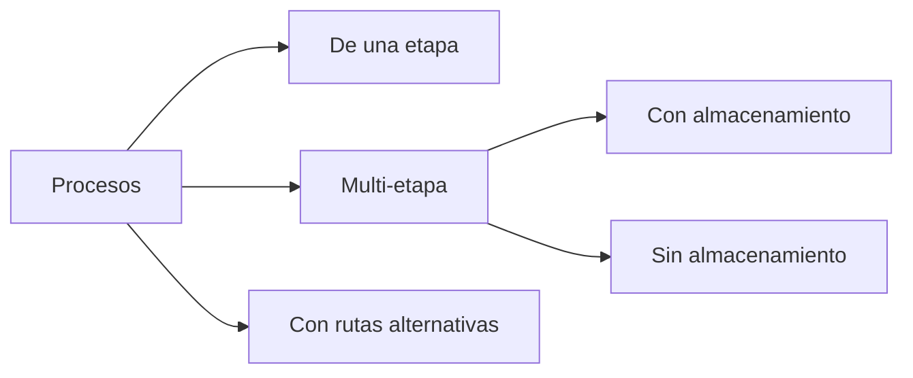
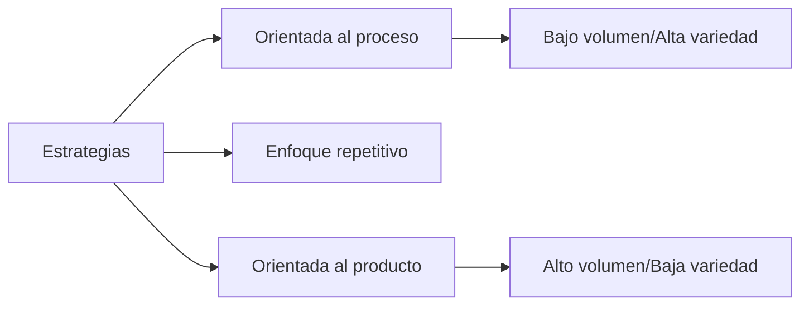

# Clase 3: Diseño de Procesos

## 🎯 Introducción

En el mundo empresarial, así como una orquesta requiere que cada músico sepa exactamente qué tocar y cuándo hacerlo, los procesos empresariales necesitan una estructura clara y bien definida para funcionar eficientemente. Como señala Hammer & Champy: "No son los productos, sino los procesos que crean esos productos los que generan el éxito de las compañías".

### ¿Qué es un Proceso?

Un proceso es cualquier parte de una empresa que toma insumos y los transforma en resultados de valor añadido. Como una cocina que convierte ingredientes en platillos terminados, un proceso empresarial consta de:

- **Entradas (Inputs)**: Materiales, información, recursos humanos
- **Transformación**: Tareas que agregan valor
- **Salidas (Outputs)**: Productos o servicios finales
- **Flujos**: Movimiento de materiales e información
- **Almacenamiento**: Inventario en proceso y productos terminados
- **Control**: Mecanismos de supervisión y ajuste

> 💡 **Nota importante**: Todo sistema está sujeto a restricciones (cuellos de botella). El éxito radica en detectarlas y abordarlas efectivamente siguiendo la Teoría de Restricciones (TOC).

## 📊 Conceptos Principales

### Medidas de Desempeño

1. **Tiempo de ciclo (cycle time)**

   - Tiempo entre unidades consecutivas
   - Fórmula: CT = 1/Tasa de producción
   - Ejemplo: Si una línea produce 60 unidades/hora, CT = 1 minuto
   - Impacto en sincronización y planificación

2. **Tasa de producción (throughput)**

   - Unidades producidas por unidad de tiempo
   - Factores que la afectan:
     - Velocidad de equipos
     - Eficiencia de operadores
     - Disponibilidad de recursos
   - Métodos de optimización

3. **Tiempo de producción (throughput time)**

   - Componentes:
     - Tiempo de procesamiento
     - Tiempo de espera
     - Tiempo de transporte
     - Tiempo de inspección
   - Técnicas de reducción

4. **Capacidad**

   - Tipos:
     - Capacidad teórica
     - Capacidad efectiva
     - Capacidad real
   - Factores limitantes
   - Estrategias de expansión

5. **Utilización**
   - Métricas de eficiencia
   - Optimización de recursos
   - Balanceo de líneas

### Tipos de Procesos

### Estrategias de Procesos

## 💻 Herramientas y Recursos

1. **Diagramas de flujo**

   - Para visualizar secuencias de operaciones
   - Identificar puntos de decisión
   - Mapear flujos de materiales e información

2. **BPMN (Business Process Model and Notation)**
   - Estándar para modelado de procesos
   - Permite documentar y comunicar procesos complejos

## 📈 Aplicaciones Prácticas

### Ejemplo 1: Proceso de Atención en Hospital

- Insumos: Pacientes, médicos, enfermeras, medicamentos
- Proceso: Atención en salud
- Resultado: Pacientes saludables

### Ejemplo 2: Proceso de Restaurante

- Insumos: Clientes hambrientos, alimentos, chef, mozos
- Proceso: Preparación y servicio de alimentos
- Resultado: Clientes satisfechos

## 🎓 Ejercicio Práctico

### Análisis de un Proceso de Panadería

**Caso de estudio:**

- Hornear: 1 hora / 100 panes
- Empaquetar: 45 minutos / 100 panes

**Pregunta:** ¿Cuál es el tiempo de producción total para 100 panes?

**Solución:**

1. Identificar etapas del proceso
2. Calcular tiempo por etapa
3. Considerar tiempos de espera
4. Sumar tiempos totales

## 🔑 Consejos Clave

1. Siempre considerar el impacto sobre:

   - Throughput
   - Inventarios
   - Costo Operacional

2. Buscar cuellos de botella y abordarlos primero

3. Considerar la variabilidad en los tiempos de proceso

## 📝 Conclusión

El diseño efectivo de procesos es fundamental para el éxito empresarial. Como una orquesta bien afinada, cada componente debe trabajar en armonía para producir el resultado deseado.

## 📚 Fórmulas Relevantes

### Ley de Little

$L = λW$
Donde:

- L = Número de unidades en el sistema
- λ = Tasa de llegada
- W = Tiempo de espera promedio

### Utilización

$U = \frac{\text{Tiempo activo}}{\text{Tiempo disponible}} \times 100\%$

## 🔍 Recursos Adicionales

1. Bizagi Modeler para modelado BPMN
2. "La Meta" de Eliyahu M. Goldratt
3. Documentación de estándares BPMN
