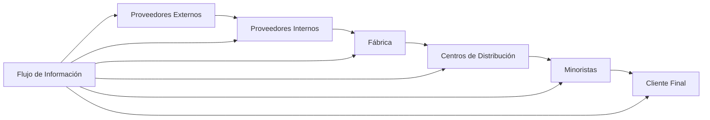
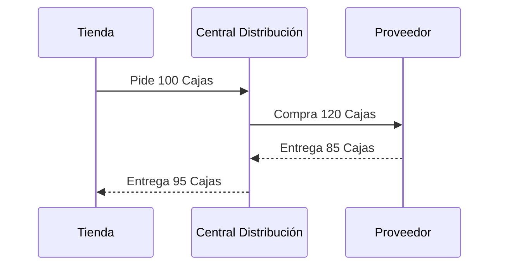

# Clase 6: Gestión de la Cadena de Abastecimiento

## 🎯 Introducción

La gestión de la cadena de abastecimiento es como dirigir una orquesta donde cada músico (proveedor, fabricante, distribuidor y minorista) debe tocar su parte en perfecta sincronía. Al igual que una orquesta necesita que el sonido fluya armoniosamente, una cadena de abastecimiento requiere que los materiales, información y productos fluyan de manera coordinada desde la materia prima hasta el consumidor final.

### ¿Qué es Supply Chain Management?

Supply Chain Management (SCM) es el proceso de planificar, organizar, dirigir y controlar el flujo de materiales e información a través de toda la cadena de valor, desde los proveedores de materias primas hasta el cliente final.

Características principales:

- Comienza con la materia prima y termina con la distribución de bienes terminados
- Busca maximizar el valor mientras minimiza las pérdidas
- Involucra a todos los participantes de la cadena, incluyendo a los proveedores de los proveedores

> 💡 Dato importante: La efectividad de una cadena de abastecimiento no solo depende de cada participante individual, sino de la sincronización entre todos ellos.

## 📊 Conceptos Principales

### Estructura de la Cadena de Abastecimiento

### Configuraciones de Red

Las estrategias de SCM varían según la configuración de la red, que puede ser:

1. Distribución Múltiple (Tipo A)
2. Consolidación Centralizada (Tipo B)
3. Centro de Cross-Docking (Tipo C)
4. Distribución Directa (Tipo D)

### Efecto Látigo

El efecto látigo es un fenómeno donde las variaciones en la demanda se amplifican a medida que se mueven hacia arriba en la cadena de suministro.

Causas principales:

- Retrasos en la información
- Retrasos en el despacho (leadtimes)
- Sobre/sub ordenamiento
- Malinterpretación del feedback

## 💻 Herramientas y Tecnologías

- RFID (Identificación por Radiofrecuencia)
- Sistemas de Intercambio Electrónico de Datos (EDI)
- Portales y Exchanges
- Sistemas de Seguimiento en Tiempo Real

## 📈 Aplicaciones Prácticas

### Caso de Estudio: Gestión de Pedidos

## 🎓 Ejercicio Práctico: El Juego de la Cerveza

- Objetivo: Experimentar la complejidad de administrar inventarios
- Elementos: Planificación centralizada vs. descentralizada
- Aprendizajes: Efectos de la amplificación de variabilidad en la demanda

## 🔑 Consejos Clave

1. Mantener comunicación constante entre todos los eslabones de la cadena
2. Implementar sistemas de seguimiento en tiempo real
3. Evitar el efecto látigo mediante una mejor planificación
4. Considerar la configuración de red más apropiada para cada caso

## 📝 Conclusión

La gestión efectiva de la cadena de abastecimiento requiere una visión integral y coordinación precisa entre todos los participantes, similar a una orquesta bien afinada. El éxito depende de la capacidad de mantener un flujo constante de materiales e información, minimizando las distorsiones y maximizando la eficiencia.

## 📚 Casos de Estudio

- Barilla SpA (A): Un caso real de implementación de SCM
- IKEA: Gestión global de cadena de suministro

## 🔍 Recursos Adicionales

- Juego de la cerveza para simulación de SCM
- Análisis de casos prácticos de efecto látigo
- Estudios sobre configuraciones de red efectivas
