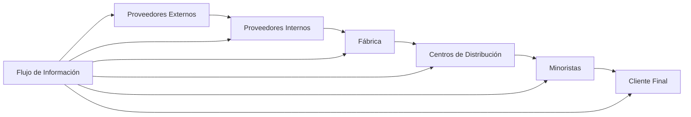
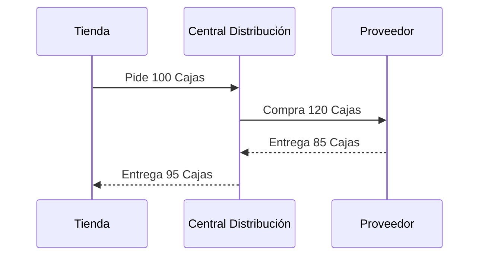

# Clase 6: Gestión de la Cadena de Abastecimiento

## 🎯 Introducción

La gestión de la cadena de abastecimiento es como dirigir una orquesta sinfónica donde cada músico (proveedor, fabricante, distribuidor y minorista) debe tocar su parte en perfecta sincronía. Al igual que una orquesta necesita que el sonido fluya armoniosamente entre todos los instrumentos para crear una pieza musical coherente, una cadena de abastecimiento requiere que los materiales, información y productos fluyan de manera coordinada desde la materia prima hasta el consumidor final.

### ¿Qué es Supply Chain Management?

Supply Chain Management (SCM) es el proceso estratégico de planificar, organizar, dirigir y controlar el flujo de materiales e información a través de toda la cadena de valor, desde los proveedores de materias primas hasta el cliente final.

Características principales:

- Comienza con la materia prima y termina con la distribución de bienes terminados
- Busca maximizar el valor mientras minimiza las pérdidas
- Involucra a todos los participantes de la cadena, incluyendo a los proveedores de los proveedores
- Integra procesos clave de negocio desde el usuario final hasta los proveedores originales
- Requiere planificación colaborativa entre todos los participantes

> 💡 Dato importante: La efectividad de una cadena de abastecimiento no solo depende de cada participante individual, sino de la sincronización y colaboración entre todos ellos, similar a cómo una orquesta necesita que todos sus músicos toquen en armonía.

## 📊 Conceptos Principales

### Estructura de la Cadena de Abastecimiento

### Configuraciones de Red

Las estrategias de SCM varían según la configuración de la red, que puede ser:

1. Distribución Múltiple (Tipo A)

- Múltiples puntos de almacenamiento
- Mayor cobertura geográfica
- Mayores costos de inventario
- Ejemplo: Redes de supermercados
- Consolidación Centralizada (Tipo B)

2. Un centro principal de distribución

- Economías de escala
- Menor costo de inventario
- Ejemplo: Amazon
- Centro de Cross-Docking (Tipo C)

3. Sin almacenamiento prolongado

- Flujo continuo de mercancías
- Reducción de costos de manipulación
- Ejemplo: Walmart
- Distribución Directa (Tipo D)

4. Envío directo al cliente

- Sin intermediarios
- Menor tiempo de entrega
- Ejemplo: Dell Computers

### Efecto Látigo

El efecto látigo es un fenómeno donde las variaciones en la demanda se amplifican a medida que se mueven hacia arriba en la cadena de suministro, similar a cómo un pequeño movimiento en la punta de un látigo causa oscilaciones cada vez más grandes hacia el mango.

Causas principales:

1. Retrasos en la información

- Demoras en comunicación
- Sistemas no integrados
- Falta de visibilidad

2. Retrasos en el despacho (leadtimes)

- Tiempos de transporte
- Demoras en producción
- Trámites administrativos

3. Sobre/sub ordenamiento

- Pedidos por lotes
- Promociones especiales
- Descuentos por volumen

4. Malinterpretación del feedback

- Señales de mercado distorsionadas
- Pronósticos independientes
- Falta de coordinación

## 💻 Herramientas y Tecnologías

- RFID (Identificación por Radiofrecuencia)
- Sistemas de Intercambio Electrónico de Datos (EDI)
- Portales y Exchanges
- Sistemas de Seguimiento en Tiempo Real

## 📈 Aplicaciones Prácticas

### Caso de Estudio: Gestión de Pedidos

## 🎓 Ejercicio Práctico: El Juego de la Cerveza

- Objetivo: Experimentar la complejidad de administrar inventarios
- Elementos: Planificación centralizada vs. descentralizada
- Aprendizajes: Efectos de la amplificación de variabilidad en la demanda

## 🔑 Consejos Clave

1. Mantener comunicación constante entre todos los eslabones de la cadena
2. Implementar sistemas de seguimiento en tiempo real
3. Evitar el efecto látigo mediante una mejor planificación
4. Considerar la configuración de red más apropiada para cada caso

## 📝 Conclusión

La gestión efectiva de la cadena de abastecimiento requiere una visión integral y coordinación precisa entre todos los participantes. El éxito depende de mantener un flujo constante de materiales e información, minimizando las distorsiones y maximizando la eficiencia. La analogía de la orquesta nos recuerda que, al igual que en la música, la sincronización y la armonía son fundamentales para lograr un resultado excepcional.

## Casos de Estudio

- Barilla SpA (A): Un caso real de implementación de SCM
- IKEA: Gestión global de cadena de suministro

## 📚 Fórmulas Relevantes

### Efecto Látigo

$$ \text{Amplificación} = \frac{\sigma^2*{\text{orden}}}{\sigma^2*{\text{demanda}}} $$

### Nivel de Servicio

$$ \text{Fill Rate} = \frac{\text{Pedidos completos entregados}}{\text{Total de pedidos}} \times 100% $$

### Rotación de Inventario

$$ \text{Rotación} = \frac{\text{Ventas anuales}}{\text{Inventario promedio}} $$

## 🔍 Recursos Adicionales

- Juego de la cerveza para simulación de SCM
- Análisis de casos prácticos de efecto látigo
- Estudios sobre configuraciones de red efectivas
