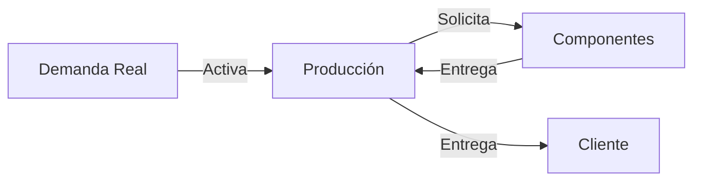
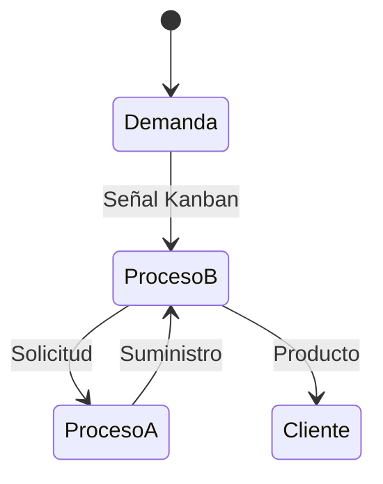

# Clase 12: Sistemas Pull y Manufactura Just-in-Time

## 🎯 Introducción

En el mundo de la manufactura moderna, podemos pensar en los sistemas de producción como una orquesta sinfónica. En un sistema tradicional (Push), cada sección musical toca según una partitura predeterminada, sin importar si las otras secciones están listas o no. En contraste, un sistema Pull es como una orquesta donde cada sección espera la señal precisa para comenzar, creando una armonía perfecta basada en la necesidad real.

### ¿Qué es un Sistema Pull?

Un sistema Pull es un método de producción donde cada proceso produce exactamente lo que el siguiente proceso necesita, cuando lo necesita. Es como una cadena de restaurantes donde cada estación solo prepara los ingredientes cuando recibe un pedido del cliente.

Características principales:

- Producción basada en demanda real
- Minimización de inventario
- Sincronización entre procesos
- Control descentralizado

> 💡 Dato importante: El sistema Pull fue popularizado por Toyota como parte del Sistema de Producción Toyota (TPS), revolucionando la manufactura global.

## 📊 Conceptos Principales

### 1. Just-in-Time (JIT)

El JIT es un sistema donde se produce:

- La cantidad correcta
- En el momento correcto
- En el lugar correcto

### 2. Sistema Kanban

Fórmula para número de Kanbans:

$$ N = \frac{D \times T}{C} $$

Donde:

- N = Número de contenedores
- D = Tasa de demanda
- T = Tiempo de entrega
- C = Capacidad del contenedor

## 💻 Herramientas y Recursos

1. Tableros Kanban
2. Sistemas de señalización visual
3. Software de control de producción
4. Contenedores estandarizados

## 📈 Aplicaciones Prácticas

### Caso Toyota

- Reducción de inventario del 75%
- Mejora de calidad del 95%
- Reducción de tiempo de entrega del 90%

### Caso Dell Computers

- Ensamblaje bajo demanda
- Personalización masiva
- Inventario mínimo

## 🎓 Ejercicio Práctico

Calcular número de Kanbans necesarios:

- Demanda: 200 unidades/hora
- Tiempo de entrega: 30 minutos
- Capacidad del contenedor: 25 unidades

Solución:
$$ N = \frac{200 \times 0.5}{25} = 4 \text{ kanbans} $$

## 🔑 Consejos Clave

1. Comenzar con procesos simples
2. Implementar gradualmente
3. Capacitar al personal
4. Mantener visibilidad del sistema
5. Mejorar continuamente

## 📝 Conclusión

Al igual que una orquesta bien afinada, un sistema Pull efectivo requiere coordinación, práctica y mejora continua. La implementación exitosa resulta en una producción más eficiente, menor desperdicio y mayor satisfacción del cliente.

## 📚 Fórmulas Relevantes

### Cálculo de Kanbans

$$ N = \frac{D \times T}{C} $$

### Eficiencia del Sistema

$$ \text{Eficiencia} = \frac{\text{Valor agregado}}{\text{Tiempo total}} \times 100\% $$

## 🔍 Recursos Adicionales

- Sistema de Producción Toyota
- Lean Manufacturing
- 5S y Control Visual
- Mejora Continua (Kaizen)
