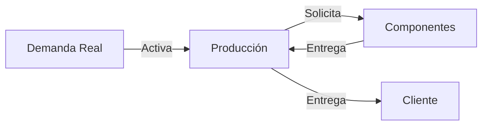
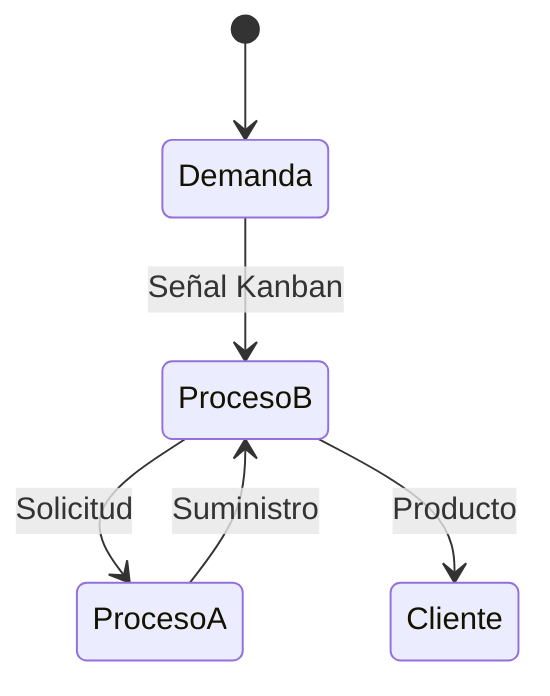

# Clase 12: Sistemas Pull y Manufactura Just-in-Time

## 🎯 Introducción

En el mundo de la manufactura moderna, podemos pensar en los sistemas de producción como una orquesta sinfónica. En un sistema tradicional (Push), cada sección musical toca según una partitura predeterminada, sin importar si las otras secciones están listas o no. En contraste, un sistema Pull es como una orquesta donde cada sección espera la señal precisa para comenzar, creando una armonía perfecta basada en la necesidad real.

### ¿Qué es un Sistema Pull?

Un sistema Pull es un método de producción donde cada proceso produce exactamente lo que el siguiente proceso necesita, cuando lo necesita. Es como una cadena de restaurantes donde cada estación solo prepara los ingredientes cuando recibe un pedido del cliente.

Características principales:

- **Producción basada en demanda real**: Solo se produce lo que se necesita, evitando la sobreproducción y reduciendo el desperdicio.
- **Minimización de inventario**: Al producir solo lo necesario, se reduce la cantidad de inventario en proceso y de productos terminados.
- **Sincronización entre procesos**: Cada proceso está alineado con el siguiente, asegurando un flujo continuo y eficiente de materiales y productos.
- **Control descentralizado**: Las decisiones de producción se toman en cada etapa del proceso, permitiendo una mayor flexibilidad y respuesta rápida a los cambios en la demanda.

> 💡 Dato importante: El sistema Pull fue popularizado por Toyota como parte del Sistema de Producción Toyota (TPS), revolucionando la manufactura global.

## 📊 Conceptos Principales

### 1. Just-in-Time (JIT)

El Just-in-Time (JIT) es una estrategia de gestión de inventarios que busca mejorar la eficiencia y reducir el desperdicio produciendo solo lo necesario, en el momento necesario y en la cantidad necesaria. Este enfoque permite a las empresas responder rápidamente a las demandas del mercado y minimizar los costos asociados con el almacenamiento de inventarios.

El JIT se basa en tres principios fundamentales:

- **La cantidad correcta**: Producir solo la cantidad de productos que se necesitan para satisfacer la demanda.
- **En el momento correcto**: Producir y entregar los productos justo cuando se necesitan, evitando el almacenamiento innecesario.
- **En el lugar correcto**: Asegurar que los productos estén disponibles en el lugar donde se necesitan, optimizando el flujo de materiales.

### 2. Sistema Kanban

El sistema Kanban es una herramienta visual que ayuda a gestionar y mejorar los procesos de producción. Utiliza tarjetas (o señales) para indicar cuándo se debe producir o mover un producto, asegurando que cada proceso reciba los materiales necesarios justo a tiempo.

Fórmula para número de Kanbans:

$$ N = \frac{D \times T}{C} $$

Donde:

- **N** = Número de contenedores
- **D** = Tasa de demanda (unidades por tiempo)
- **T** = Tiempo de entrega (tiempo que tarda en reponer el inventario)
- **C** = Capacidad del contenedor (unidades por contenedor)

El sistema Kanban permite una producción más flexible y eficiente, ya que cada proceso solo produce lo que el siguiente proceso necesita, reduciendo el exceso de inventario y mejorando el flujo de trabajo.

## 💻 Herramientas y Recursos

1. **Tableros Kanban**: Herramientas visuales que ayudan a gestionar el flujo de trabajo y a identificar cuellos de botella.
2. **Sistemas de señalización visual**: Indicadores que muestran el estado de los procesos y ayudan a coordinar las actividades de producción.
3. **Software de control de producción**: Programas que automatizan la gestión de inventarios y la planificación de la producción.
4. **Contenedores estandarizados**: Recipientes uniformes que facilitan el manejo y el transporte de materiales, mejorando la eficiencia del sistema.

## 📈 Aplicaciones Prácticas

### Caso Toyota

- **Reducción de inventario del 75%**: Implementando el sistema Pull, Toyota logró reducir significativamente el inventario en proceso y de productos terminados.
- **Mejora de calidad del 95%**: La sincronización de los procesos y la producción basada en demanda real resultaron en una mejora notable en la calidad de los productos.
- **Reducción de tiempo de entrega del 90%**: Al producir solo lo necesario y cuando es necesario, Toyota pudo reducir drásticamente los tiempos de entrega.

### Caso Dell Computers

- **Ensamblaje bajo demanda**: Dell utiliza un sistema Pull para ensamblar computadoras solo cuando se recibe un pedido, permitiendo una mayor personalización y reducción de inventarios.
- **Personalización masiva**: La producción basada en demanda real permite a Dell ofrecer una amplia variedad de configuraciones personalizadas sin aumentar los costos de inventario.
- **Inventario mínimo**: Al producir solo lo necesario, Dell mantiene niveles de inventario muy bajos, reduciendo los costos asociados con el almacenamiento y el manejo de materiales.

## 🎓 Ejercicio Práctico

Calcular número de Kanbans necesarios:

- **Demanda**: 200 unidades/hora
- **Tiempo de entrega**: 30 minutos
- **Capacidad del contenedor**: 25 unidades

Solución:
$$ N = \frac{200 \times 0.5}{25} = 4 \text{ kanbans} $$

## 🔑 Consejos Clave

1. **Comenzar con procesos simples**: Implementar el sistema Pull en procesos sencillos antes de expandirlo a toda la producción.
2. **Implementar gradualmente**: Introducir cambios de manera gradual para permitir la adaptación y minimizar el impacto en la producción.
3. **Capacitar al personal**: Asegurar que todos los empleados comprendan el sistema Pull y cómo aplicarlo en sus tareas diarias.
4. **Mantener visibilidad del sistema**: Utilizar herramientas visuales para monitorear el estado de los procesos y detectar problemas rápidamente.
5. **Mejorar continuamente**: Evaluar y ajustar constantemente el sistema Pull para optimizar la eficiencia y la calidad de la producción.

## 📝 Conclusión

Al igual que una orquesta bien afinada, un sistema Pull efectivo requiere coordinación, práctica y mejora continua. La implementación exitosa resulta en una producción más eficiente, menor desperdicio y mayor satisfacción del cliente.

## 📚 Fórmulas Relevantes

### Cálculo de Kanbans

$$ N = \frac{D \times T}{C} $$

### Eficiencia del Sistema

$$ \text{Eficiencia} = \frac{\text{Valor agregado}}{\text{Tiempo total}} \times 100\% $$

## 🔍 Recursos Adicionales

- Sistema de Producción Toyota
- Lean Manufacturing
- 5S y Control Visual
- Mejora Continua (Kaizen)
