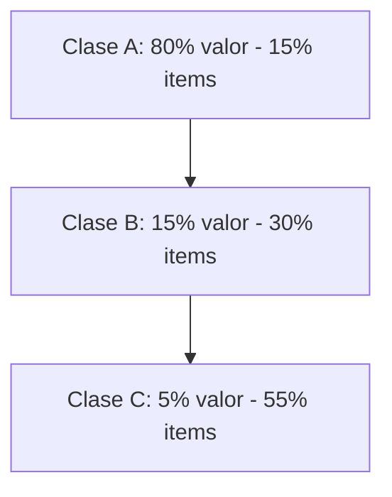

# Clase 13: Control de Inventarios I

## 🎯 Introducción

El control de inventarios es como mantener una despensa bien organizada: necesitamos saber qué tenemos, cuándo debemos comprar más y cuánto comprar para no desperdiciar recursos ni quedarnos sin lo necesario. En el contexto empresarial, este proceso es fundamental para mantener las operaciones funcionando eficientemente mientras se optimizan los costos. Un buen control de inventarios permite a las empresas reducir costos, mejorar el flujo de caja y aumentar la satisfacción del cliente al garantizar la disponibilidad de productos.

### ¿Qué es un Sistema de Inventario?

Un sistema de inventario es un conjunto de políticas y controles que monitorean y determinan:

- Los niveles de inventario que debemos mantener
- El momento adecuado para reponer el stock
- La cantidad óptima a ordenar

Estos sistemas pueden ser manuales o automatizados y utilizan diversas técnicas y herramientas para asegurar que los inventarios se gestionen de manera eficiente. Un sistema de inventario efectivo ayuda a minimizar los costos de almacenamiento y los costos de pedido, al mismo tiempo que asegura que los productos estén disponibles cuando se necesiten.

> 💡 Dato importante: El inventario no solo incluye productos terminados, sino también materias primas, componentes, suministros y trabajo en proceso. Esto significa que el control de inventarios abarca todas las etapas de la producción y distribución, desde la adquisición de materias primas hasta la entrega del producto final al cliente.

## 📊 Conceptos Principales

### Medidas Fundamentales del Inventario

1. **Valor del Inventario Agregado Promedio**

   - El promedio del valor total de todos los ítems mantenidos en inventario. Esta medida es crucial para entender cuánto capital está inmovilizado en inventarios.
   - $ValorInventario = \frac{\sum{ValorItem_i}}{n}$

2. **Semanas de Inventario**

   - Valor del inventario agregado promedio dividido por el costo de bienes vendidos por semana. Esta métrica indica cuántas semanas de ventas puede cubrir el inventario actual.
   - $SemanasInventario = \frac{ValorInventario}{CostoBienesVendidosSemanal}$

3. **Rotación de Inventario**

   - Costo de bienes vendidos por año dividido por el valor del inventario agregado promedio. Una alta rotación de inventario indica que los productos se venden rápidamente, lo cual es generalmente positivo.
   - $RotacionInventario = \frac{CostoBienesVendidosAnual}{ValorInventario}$

### Análisis ABC de Inventarios

El análisis ABC es una técnica de categorización de inventarios basada en el principio de Pareto, que sugiere que un pequeño porcentaje de los ítems en inventario representa la mayor parte del valor total.

- **Clase A**: Items críticos que requieren mayor control y monitoreo frecuente debido a su alto valor.
- **Clase B**: Items de importancia moderada que requieren un control regular.
- **Clase C**: Items de menor valor pero mayor volumen, que requieren un control menos riguroso.

### Modelo EOQ (Economic Order Quantity)

El modelo EOQ determina la cantidad óptima a ordenar minimizando los costos totales de inventario, que incluyen los costos de pedido y los costos de almacenamiento.

$$ Q\_{opt} = \sqrt{\frac{2DS}{H}} $$

Donde:

- D = Demanda anual
- S = Costo de poner una orden
- H = Costo anual de almacenaje por unidad

Este modelo asume una demanda constante y tiempos de entrega fijos, y es útil para empresas que buscan optimizar sus niveles de inventario y reducir costos.

## 💻 Herramientas y Recursos

### Fórmulas Esenciales

1. **Punto de Reorden**
   $$ R = \bar{d}L $$

   - $\bar{d}$ = Demanda promedio diaria
   - L = Tiempo de retraso en reposición

   El punto de reorden es el nivel de inventario al cual se debe realizar un nuevo pedido para evitar quedarse sin stock.

2. **Costo Total Anual**
   $$ TC = DC + \frac{D}{Q}S + \frac{Q}{2}H $$

   Esta fórmula calcula el costo total anual de mantener el inventario, considerando los costos de pedido y almacenamiento.

## 📈 Aplicaciones Prácticas

### Ejemplo de EOQ

Datos:

- Demanda anual = 1,000 unidades
- Costo por orden = $10
- Costo de almacenaje = $2.50/unidad/año
- Tiempo de reposición = 7 días

Solución:

1. Calcular EOQ:
   $$ Q\_{opt} = \sqrt{\frac{2(1,000)(10)}{2.50}} = 89.44 \approx 90 \text{ unidades} $$

2. Calcular punto de reorden:
   - Demanda diaria = 1,000/365 = 2.74 unidades/día
   - R = 2.74 × 7 = 19.18 ≈ 20 unidades

Este ejemplo muestra cómo utilizar el modelo EOQ para determinar la cantidad óptima de pedido y el punto de reorden, ayudando a minimizar los costos de inventario.

## 🔑 Consejos Clave

1. **Priorización ABC**

   - Enfoque mayor control en items clase A, ya que representan la mayor parte del valor del inventario.
   - Establece diferentes niveles de monitoreo según la clase para optimizar recursos.

2. **Optimización de Costos**

   - El objetivo no es maximizar la rotación sino optimizar la rentabilidad. Una alta rotación puede indicar una buena gestión, pero también puede significar costos elevados si no se maneja adecuadamente.
   - Considera el balance entre costos de ordenar y almacenar para encontrar el punto óptimo.

3. **Monitoreo Continuo**

   - Mantén sistemas actualizados para reflejar cambios en la demanda y otros factores.
   - Revisa periódicamente los parámetros del modelo para asegurarte de que siguen siendo válidos.

## 📝 Conclusión

El control efectivo de inventarios requiere un balance entre disponibilidad de productos y costos operativos. Los modelos matemáticos como EOQ proporcionan una base sólida para la toma de decisiones, pero deben complementarse con juicio empresarial y consideraciones prácticas. La implementación de un buen sistema de inventario puede llevar a una mejora significativa en la eficiencia operativa y la rentabilidad de la empresa.

## 📚 Fórmulas Relevantes

### Métricas Básicas

- GMROI (Gross Margin Return on Investment)
  $$ GMROI = \frac{Margen(\$)}{Inventario(\$)} = Mg(\%) \times \text{Rotación} $$

### Modelo EOQ

- Cantidad Óptima de Orden
  $$ Q\_{opt} = \sqrt{\frac{2DS}{H}} $$
- Punto de Reorden
  $$ R = \bar{d}L $$
- Costo Total
  $$ TC = DC + \frac{D}{Q}S + \frac{Q}{2}H $$

## 🔍 Recursos Adicionales

- Simuladores de EOQ online
- Planillas de cálculo para análisis ABC
- Software de gestión de inventarios
