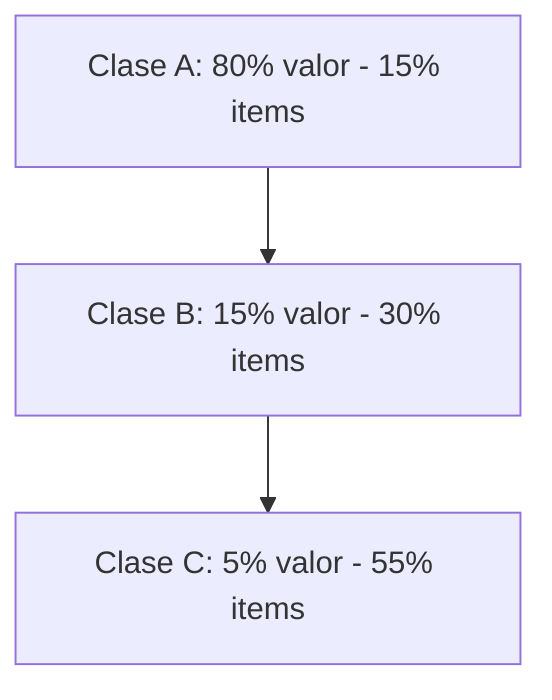

# Clase 13: Control de Inventarios I

## 🎯 Introducción

El control de inventarios es como mantener una despensa bien organizada: necesitamos saber qué tenemos, cuándo debemos comprar más y cuánto comprar para no desperdiciar recursos ni quedarnos sin lo necesario. En el contexto empresarial, este proceso es fundamental para mantener las operaciones funcionando eficientemente mientras se optimizan los costos.

### ¿Qué es un Sistema de Inventario?

Un sistema de inventario es un conjunto de políticas y controles que monitorean y determinan:

- Los niveles de inventario que debemos mantener
- El momento adecuado para reponer el stock
- La cantidad óptima a ordenar

> 💡 Dato importante: El inventario no solo incluye productos terminados, sino también materias primas, componentes, suministros y trabajo en proceso.

## 📊 Conceptos Principales

### Medidas Fundamentales del Inventario

1. **Valor del Inventario Agregado Promedio**

   - El promedio del valor total de todos los ítems mantenidos en inventario
   - $ValorInventario = \frac{\sum{ValorItem_i}}{n}$

2. **Semanas de Inventario**

   - Valor del inventario agregado promedio dividido por el costo de bienes vendidos por semana
   - $SemanasInventario = \frac{ValorInventario}{CostoBienesVendidosSemanal}$

3. **Rotación de Inventario**
   - Costo de bienes vendidos por año dividido por el valor del inventario agregado promedio
   - $RotacionInventario = \frac{CostoBienesVendidosAnual}{ValorInventario}$

### Análisis ABC de Inventarios

El principio de Pareto aplicado a inventarios demuestra que:

- Clase A: Items críticos que requieren mayor control
- Clase B: Items de importancia moderada
- Clase C: Items de menor valor pero mayor volumen

### Modelo EOQ (Economic Order Quantity)

El modelo EOQ determina la cantidad óptima a ordenar minimizando los costos totales:

$$ Q\_{opt} = \sqrt{\frac{2DS}{H}} $$

Donde:

- D = Demanda anual
- S = Costo de poner una orden
- H = Costo anual de almacenaje por unidad

## 💻 Herramientas y Recursos

### Fórmulas Esenciales

1. **Punto de Reorden**
   $$ R = \bar{d}L $$

   - $\bar{d}$ = Demanda promedio diaria
   - L = Tiempo de retraso en reposición

2. **Costo Total Anual**
   $$ TC = DC + \frac{D}{Q}S + \frac{Q}{2}H $$

## 📈 Aplicaciones Prácticas

### Ejemplo de EOQ

Datos:

- Demanda anual = 1,000 unidades
- Costo por orden = $10
- Costo de almacenaje = $2.50/unidad/año
- Tiempo de reposición = 7 días

Solución:

1. Calcular EOQ:
   $$ Q\_{opt} = \sqrt{\frac{2(1,000)(10)}{2.50}} = 89.44 \approx 90 \text{ unidades} $$

2. Calcular punto de reorden:
   - Demanda diaria = 1,000/365 = 2.74 unidades/día
   - R = 2.74 × 7 = 19.18 ≈ 20 unidades

## 🔑 Consejos Clave

1. **Priorización ABC**

   - Enfoque mayor control en items clase A
   - Establece diferentes niveles de monitoreo según la clase

2. **Optimización de Costos**

   - El objetivo no es maximizar la rotación sino optimizar la rentabilidad
   - Considera el balance entre costos de ordenar y almacenar

3. **Monitoreo Continuo**
   - Mantén sistemas actualizados
   - Revisa periódicamente los parámetros del modelo

## 📝 Conclusión

El control efectivo de inventarios requiere un balance entre disponibilidad de productos y costos operativos. Los modelos matemáticos como EOQ proporcionan una base sólida para la toma de decisiones, pero deben complementarse con juicio empresarial y consideraciones prácticas.

## 📚 Fórmulas Relevantes

### Métricas Básicas

- GMROI (Gross Margin Return on Investment)
  $$ GMROI = \frac{Margen(\$)}{Inventario(\$)} = Mg(\%) \times \text{Rotación} $$

### Modelo EOQ

- Cantidad Óptima de Orden
  $$ Q\_{opt} = \sqrt{\frac{2DS}{H}} $$
- Punto de Reorden
  $$ R = \bar{d}L $$
- Costo Total
  $$ TC = DC + \frac{D}{Q}S + \frac{Q}{2}H $$

## 🔍 Recursos Adicionales

- Simuladores de EOQ online
- Planillas de cálculo para análisis ABC
- Software de gestión de inventarios
