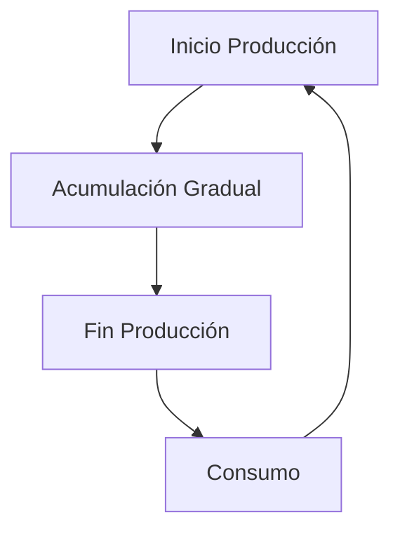

# Clase 14: Control de Inventarios II

## 🎯 Introducción

El control de inventarios en situaciones reales raramente sigue un modelo simple y perfecto. Así como un chef debe ajustar sus recetas según los ingredientes disponibles y las preferencias del cliente, las empresas deben adaptar sus modelos de inventario a diferentes situaciones y restricciones. Esto implica considerar factores como la variabilidad en la demanda, los tiempos de entrega, y las limitaciones de almacenamiento.

### ¿Qué son las extensiones del modelo EOQ?

Son adaptaciones del modelo básico EOQ (Economic Order Quantity) que consideran situaciones más realistas. Estas extensiones permiten a las empresas manejar mejor sus inventarios bajo diferentes condiciones y restricciones. Algunas de las extensiones más comunes incluyen:

- **Lotes de producción**: Adaptación del EOQ para situaciones donde los productos se fabrican internamente en lugar de comprarse a proveedores externos.
- **Descuentos por cantidad**: Ajuste del EOQ para considerar los descuentos ofrecidos por los proveedores al comprar en grandes cantidades.
- **Múltiples productos**: Extensión del EOQ para manejar la gestión de inventarios de varios productos simultáneamente.
- **Capacidad limitada de almacenamiento**: Modificación del EOQ para tener en cuenta las limitaciones físicas del espacio de almacenamiento disponible.

> 💡 Dato importante: El modelo EOQ básico asume condiciones ideales que raramente existen en la realidad, como demanda constante y tiempos de entrega fijos.

## 📊 Conceptos Principales

### 1. EOQ para Lotes de Producción (POQ)

Este modelo se utiliza cuando los productos se fabrican en lugar de comprarse. La principal diferencia es que el inventario se acumula gradualmente durante la producción, en lugar de recibirse todo de una vez. Esto es común en industrias manufactureras donde la producción es continua y no se puede detener fácilmente.

La fórmula clave es:

$$ Q\* = \sqrt{\frac{2DS}{H(1-d/p)}} $$

Donde:

- $p$ = tasa de producción (unidades por tiempo)
- $d$ = tasa de demanda (unidades por tiempo)
- $D$ = demanda total (unidades)
- $S$ = costo de setup (costo por orden)
- $H$ = costo de mantener inventario (costo por unidad por tiempo)

### 2. EOQ con Descuentos por Cantidad

Cuando los proveedores ofrecen descuentos por volumen, el modelo EOQ debe considerar los diferentes precios según la cantidad ordenada. Esto implica calcular el EOQ para cada nivel de precio y luego determinar cuál es el más económico considerando los costos totales.

La fórmula base sigue siendo:

$$ Q\_{OPT} = \sqrt{\frac{2DS}{iC}} $$

Donde:

- $i$ = porcentaje del costo para calcular costo de inventario (tasa de mantenimiento)
- $C$ = costo por unidad (varía según el rango de cantidad)

### 3. Inventarios bajo Incertidumbre

En la realidad, la demanda y los tiempos de entrega suelen ser variables aleatorias. Para manejar esta incertidumbre, se utiliza el concepto de inventario de seguridad, que es una cantidad adicional de stock para protegerse contra variaciones inesperadas en la demanda o en los tiempos de entrega.

La fórmula para el punto de reorden con inventario de seguridad es:

$$ R = \bar{d}L + Z\_{\alpha}\sigma\sqrt{L} $$

Donde:

- $R$ = punto de reorden (unidades)
- $\bar{d}$ = demanda promedio (unidades por tiempo)
- $L$ = tiempo de entrega (tiempo)
- $Z_{\alpha}$ = factor de seguridad (valor z de la distribución normal)
- $\sigma$ = desviación estándar de la demanda (unidades)

## 💻 Herramientas y Recursos

Para implementar y gestionar estos modelos de inventario, las empresas pueden utilizar diversas herramientas y recursos, tales como:

- **Hojas de cálculo**: Para realizar análisis de costos y cálculos de EOQ.
- **Software de gestión de inventarios**: Sistemas especializados que automatizan el seguimiento y la gestión de inventarios.
- **Calculadoras de punto de reorden**: Herramientas que ayudan a determinar cuándo realizar nuevos pedidos.
- **Sistemas de pronóstico de demanda**: Software que utiliza datos históricos para predecir la demanda futura.

## 📈 Aplicaciones Prácticas

### Ejemplo 1: Descuentos por Cantidad

Una empresa compra componentes con la siguiente estructura de descuentos:

- 0 a 2,499 unidades: $1.20/unidad
- 2,500 a 3,999 unidades: $1.00/unidad
- 4,000 o más unidades: $0.98/unidad

Con una demanda anual de 10,000 unidades, un costo de orden de $4, y un costo de inventario del 2% del valor del ítem, se debe calcular el EOQ para cada rango de precio y determinar cuál es el más económico.

### Ejemplo 2: Modelo del Vendedor de Diarios

Un vendedor debe decidir cuántos periódicos comprar diariamente, considerando:

- Demanda media: 11.73 unidades
- Desviación estándar: 4.74 unidades
- Costo de compra: $0.25 por unidad
- Precio de venta: $0.75 por unidad
- Valor de recuperación: $0.10 por unidad

## 🎓 Ejercicio Práctico

Calcular la cantidad óptima a ordenar para el ejemplo de descuentos por cantidad:

1. Calcular EOQ para cada rango de precio.
2. Verificar si el EOQ calculado está dentro del rango correspondiente.
3. Calcular costos totales para las cantidades factibles.
4. Seleccionar la cantidad que minimiza el costo total.

## 🔑 Consejos Clave

1. Siempre verificar que las soluciones EOQ estén dentro de los rangos válidos.
2. Considerar restricciones prácticas como capacidad de almacenamiento.
3. Incluir stock de seguridad cuando hay incertidumbre en la demanda.
4. Evaluar el impacto de los descuentos en el costo total.

## 📝 Conclusión

Los modelos de inventario deben adaptarse a las condiciones reales del negocio. La clave está en encontrar el balance entre los diferentes costos y restricciones operativas. Adaptar los modelos teóricos a la práctica diaria puede significar la diferencia entre una gestión de inventarios eficiente y una ineficiente.

## 📚 Fórmulas Relevantes

### EOQ Básico

$$ Q\_{OPT} = \sqrt{\frac{2DS}{iC}} $$

### EOQ para Lotes de Producción

$$ Q^{\text{\*}} = \sqrt{\frac{2DS}{H(1-d/p)}} $$

### Punto de Reorden con Inventario de Seguridad

$$ R = \bar{d}L + Z\_{\alpha}\sigma\sqrt{L} $$

### Modelo del Vendedor de Diarios

$$ F(Q^\*) = \frac{c_u}{c_o + c_u} $$

## 🔍 Recursos Adicionales

- Libros de texto sobre gestión de operaciones.
- Simuladores de inventario en línea.
- Casos de estudio de empresas reales.
- Herramientas de optimización de inventario.
