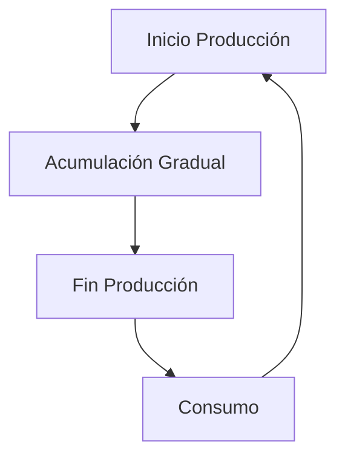

# Clase 14: Control de Inventarios II

## 🎯 Introducción

El control de inventarios en situaciones reales raramente sigue un modelo simple y perfecto. Así como un chef debe ajustar sus recetas según los ingredientes disponibles y las preferencias del cliente, las empresas deben adaptar sus modelos de inventario a diferentes situaciones y restricciones.

### ¿Qué son las extensiones del modelo EOQ?

Son adaptaciones del modelo básico EOQ que consideran situaciones más realistas como:

- Lotes de producción
- Descuentos por cantidad
- Múltiples productos
- Capacidad limitada de almacenamiento

> 💡 Dato importante: El modelo EOQ básico asume condiciones ideales que raramente existen en la realidad.

## 📊 Conceptos Principales

### 1. EOQ para Lotes de Producción (POQ)

Este modelo se utiliza cuando los productos se fabrican en lugar de comprarse. La principal diferencia es que el inventario se acumula gradualmente durante la producción, en lugar de recibirse todo de una vez.

La fórmula clave es:

$$ Q\* = \sqrt{\frac{2DS}{H(1-d/p)}} $$

Donde:

- $p$ = tasa de producción
- $d$ = tasa de demanda
- $D$ = demanda total
- $S$ = costo de setup
- $H$ = costo de mantener inventario

### 2. EOQ con Descuentos por Cantidad

Cuando los proveedores ofrecen descuentos por volumen, el modelo debe considerar los diferentes precios según la cantidad ordenada.

La fórmula base sigue siendo:

$$ Q\_{OPT} = \sqrt{\frac{2DS}{iC}} $$

Donde:

- $i$ = porcentaje del costo para calcular costo de inventario
- $C$ = costo por unidad (varía según el rango de cantidad)

### 3. Inventarios bajo Incertidumbre

En la realidad, la demanda y los tiempos de entrega suelen ser variables aleatorias. Para manejar esta incertidumbre:

$$ R = \bar{d}L + Z\_{\alpha}\sigma\sqrt{L} $$

Donde:

- $R$ = punto de reorden
- $\bar{d}$ = demanda promedio
- $L$ = tiempo de entrega
- $Z_{\alpha}$ = factor de seguridad
- $\sigma$ = desviación estándar de la demanda

## 💻 Herramientas y Recursos

- Hojas de cálculo para análisis de costos
- Software de gestión de inventarios
- Calculadoras de punto de reorden
- Sistemas de pronóstico de demanda

## 📈 Aplicaciones Prácticas

### Ejemplo 1: Descuentos por Cantidad

Una empresa compra componentes con la siguiente estructura de descuentos:

- 0 a 2,499 unidades: $1.20/unidad
- 2,500 a 3,999 unidades: $1.00/unidad
- 4,000 o más unidades: $0.98/unidad

Con demanda anual de 10,000 unidades, costo de orden $4, y costo de inventario 2% del valor del ítem.

### Ejemplo 2: Modelo del Vendedor de Diarios

Un vendedor debe decidir cuántos periódicos comprar diariamente:

- Demanda media: 11.73
- Desviación estándar: 4.74
- Costo de compra: $0.25
- Precio de venta: $0.75
- Valor de recuperación: $0.10

## 🎓 Ejercicio Práctico

Calcular la cantidad óptima a ordenar para el ejemplo de descuentos por cantidad:

1. Calcular EOQ para cada rango de precio
2. Verificar si el EOQ calculado está dentro del rango correspondiente
3. Calcular costos totales para las cantidades factibles
4. Seleccionar la cantidad que minimiza el costo total

## 🔑 Consejos Clave

1. Siempre verificar que las soluciones EOQ estén dentro de los rangos válidos
2. Considerar restricciones prácticas como capacidad de almacenamiento
3. Incluir stock de seguridad cuando hay incertidumbre en la demanda
4. Evaluar el impacto de los descuentos en el costo total

## 📝 Conclusión

Los modelos de inventario deben adaptarse a las condiciones reales del negocio. La clave está en encontrar el balance entre los diferentes costos y restricciones operativas.

## 📚 Fórmulas Relevantes

### EOQ Básico

$$ Q\_{OPT} = \sqrt{\frac{2DS}{iC}} $$

### EOQ para Lotes de Producción

$$ Q^{\text{\*}} = \sqrt{\frac{2DS}{H(1-d/p)}} $$

### Punto de Reorden con Inventario de Seguridad

$$ R = \bar{d}L + Z\_{\alpha}\sigma\sqrt{L} $$

### Modelo del Vendedor de Diarios

$$ F(Q^\*) = \frac{c_u}{c_o + c_u} $$

## 🔍 Recursos Adicionales

- Libros de texto sobre gestión de operaciones
- Simuladores de inventario en línea
- Casos de estudio de empresas reales
- Herramientas de optimización de inventario
