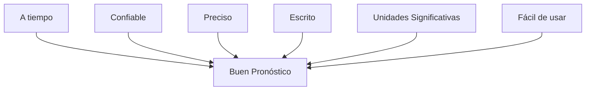

# Clase 16 y 17: Pronósticos

## 🎯 Introducción

Los pronósticos son una parte fundamental de nuestra vida diaria y los negocios. Imagina que eres el chef de un restaurante y debes decidir cuántos ingredientes comprar para la próxima semana, o el dueño de una librería intentando determinar cuántos libros necesitarás para el próximo semestre universitario. Estas decisiones cotidianas se basan en pronósticos.

### ¿Qué son los pronósticos?

Los pronósticos son predicciones informadas sobre eventos futuros que nos ayudan a tomar mejores decisiones en el presente. Son como un GPS que nos ayuda a navegar hacia el futuro, proporcionando una dirección aunque no siempre el camino exacto.

Características fundamentales:

- No son perfectos, siempre existe un margen de error.
- Son más precisos para grupos que para elementos individuales.
- Son más confiables en horizontes de tiempo cortos.
- Asumen que los patrones históricos continuarán en el futuro.

> 💡 Dato importante: Los pronósticos son una de las funciones más críticas en los negocios, ya que afectan decisiones sobre mercados, productos, inventarios y personal.

## 📊 Conceptos Principales

### 1. Elementos de un Buen Pronóstico

Un buen pronóstico debe cumplir con varias características clave para ser útil y efectivo. Entre ellas se incluyen:

- **A tiempo**: Debe estar disponible cuando se necesite para la toma de decisiones.
- **Confiable**: Debe ser consistente y basado en datos y métodos sólidos.
- **Preciso**: Debe acercarse lo más posible a los resultados reales.
- **Escrito**: Debe estar documentado para referencia futura y para evaluar su precisión.
- **Unidades Significativas**: Debe expresarse en unidades que sean relevantes y comprensibles para los usuarios.
- **Fácil de usar**: Debe ser comprensible y aplicable sin necesidad de conocimientos técnicos avanzados.

### 2. Tipos de Métodos de Pronóstico

#### Métodos Cualitativos

Los métodos cualitativos se basan en el juicio y la experiencia de expertos. Son útiles cuando no se dispone de datos históricos suficientes o cuando se espera que el futuro sea significativamente diferente del pasado. Estos métodos pueden incorporar cambios recientes del mercado y otras variables difíciles de cuantificar.

#### Métodos Cuantitativos

Los métodos cuantitativos utilizan modelos matemáticos y estadísticos para analizar datos históricos y proyectar tendencias futuras. Son consistentes y objetivos, y pueden procesar grandes cantidades de datos para generar pronósticos precisos. Estos métodos son ideales cuando se dispone de datos históricos suficientes y se espera que los patrones pasados continúen en el futuro.

### 3. Modelos de Series de Tiempo

Los modelos de series de tiempo analizan datos históricos para identificar patrones y proyectar estos patrones hacia el futuro. La lógica fundamental es:
$$ Datos = patrón\ histórico + variación\ aleatoria $$

Componentes principales:

1. **Nivel**: El promedio de largo plazo de la serie de datos.
2. **Tendencia**: La dirección general en la que se mueve la serie de datos a lo largo del tiempo.
3. **Estacionalidad**: Patrones recurrentes que ocurren en intervalos regulares, como días, meses o estaciones.
4. **Ciclo**: Fluctuaciones que ocurren en períodos más largos, generalmente asociados con ciclos económicos.

## 💻 Herramientas y Técnicas

### 1. Media Móvil Simple

La media móvil simple es una técnica que promedia un número fijo de observaciones pasadas para suavizar la serie de datos y eliminar la variabilidad aleatoria. La fórmula es:
$$ F*t = \frac{A*{t-1} + A*{t-2} + A*{t-3} + ... + A\_{t-n}}{n} $$

### 2. Media Móvil Ponderada

La media móvil ponderada asigna diferentes pesos a las observaciones pasadas, dando más importancia a las observaciones más recientes. La fórmula es:
$$ F*t = w_1A*{t-1} + w*2A*{t-2} + w*3A*{t-3} + ... + w*nA*{t-n} $$
Donde: $\sum_{i=1}^n w_i = 1$

### 3. Atenuación Exponencial

La atenuación exponencial es una técnica que aplica un factor de suavización a las observaciones pasadas, dando más peso a las observaciones más recientes. La fórmula es:
$$ F\_{t+1} = \alpha A_t + (1-\alpha)F_t $$

## 📈 Aplicaciones Prácticas

### Ejemplo: Predicción de Ventas de Cerveza

Consideremos un pub que busca predecir las ventas de nuevas cervezas basándose en datos históricos. El proceso puede visualizarse como:

Modelo de regresión lineal:
$$ Ventas = 1246.46 - 94.82(Precio) $$

## 🎓 Ejercicio Práctico

Calcular el pronóstico de ventas para una cerveza con:

- Precio: $3.65
- Días disponibles: 30
- Días de promoción: 5

Solución usando regresión múltiple:
$$ Ventas = 1061.04 - 99.22(Precio) + 1.01(Días) + 4.55(Promoción) $$

## 🔑 Consejos Clave

1. Seleccionar el método apropiado según el contexto y datos disponibles.
2. Monitorear constantemente la precisión del pronóstico.
3. Actualizar los modelos según nueva información.
4. No extrapolar más allá del rango de datos históricos.

## 📝 Conclusión

Los pronósticos son herramientas esenciales para la toma de decisiones empresariales. Aunque no son perfectos, cuando se utilizan correctamente pueden proporcionar información valiosa para la planificación y gestión de operaciones.

## 📚 Fórmulas Relevantes

### Modelos de Series de Tiempo

1. Media Móvil Simple:
   $$ F*t = \frac{\sum*{i=1}^n A\_{t-i}}{n} $$

2. Media Móvil Ponderada:
   $$ F*t = \sum*{i=1}^n w*iA*{t-i} $$

3. Atenuación Exponencial:
   $$ F\_{t+1} = \alpha A_t + (1-\alpha)F_t $$

### Medidas de Error

1. MAD (Mean Absolute Deviation):
   $$ MAD = \frac{\sum|A_t - F_t|}{n} $$

2. MSE (Mean Square Error):
   $$ MSE = \frac{\sum(A_t - F_t)^2}{n} $$

3. MAPE (Mean Absolute Percentage Error):
   $$ MAPE = \frac{\sum|(A_t - F_t)/A_t|}{n} $$

## 🔍 Recursos Adicionales

- Hojas de cálculo para pronósticos.
- Software estadístico (R, Python).
- Bases de datos históricas.
- Modelos de pronóstico avanzados.
