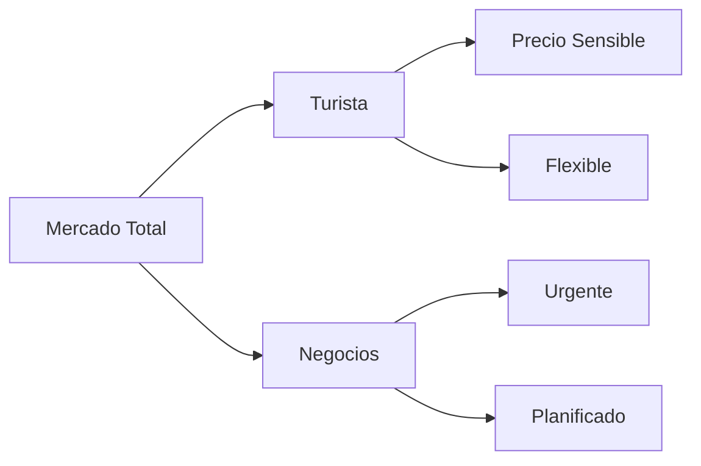
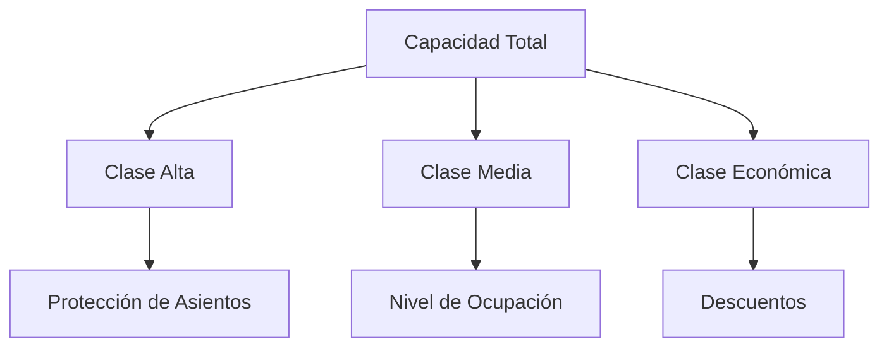

Let me help you create an educational document based on the Revenue Management slides. I'll generate a comprehensive markdown document following your format.

# Clase 18: Revenue Management

## 🎯 Introducción

Revenue Management es como la dirección de una orquesta donde cada instrumento (precio, capacidad, demanda) debe tocar en el momento preciso para crear la mejor sinfonía (maximizar ingresos). Imagina un teatro con asientos limitados - algunos espectadores están dispuestos a comprar entradas con anticipación a precio completo, mientras otros esperan ofertas de último minuto.

### ¿Qué es Revenue Management?

Revenue Management es una estrategia que busca vender el producto correcto, al cliente correcto, en el momento correcto y al precio correcto. Es como un director de tráfico aéreo que debe optimizar el uso de las pistas disponibles.

Características principales:

- Producto perecible con horizonte de venta fijo
- Capacidad fija irreversible
- Demanda estocástica (variable)
- Segmentación de demanda por precio
- Capacidad de aceptar o rechazar clientes

> 💡 Dato importante: Revenue Management surgió en la industria aérea tras la desregulación de 1978, generando incrementos típicos de 5-10% en ingresos.

## 📊 Conceptos Principales

### 1. Segmentación de Mercado

La segmentación permite identificar diferentes grupos de clientes con distintas disposiciones a pagar.

### 2. Gestión de Capacidad

## 💻 Herramientas y Aplicaciones

### Industrias que aplican RM:

- Aerolíneas
- Hoteles
- Retail
- Telecomunicaciones
- Marítima
- Trenes
- Televisión

## 📈 Aplicaciones Prácticas

### Ejemplo 1: Peluquería

- Un asiento de corte
- Precios 20% más altos el sábado
- Precios 20% más bajos el martes
- Resultado: Reducción de tiempos de espera de 2 horas a 30 minutos
- Aumento de ventas del 20%

### Ejemplo 2: Retail

- Productos perecibles (ej: ropa de temporada)
- Tiempo de reposición: 6 meses
- Horizonte de venta: 3 meses
- Gestión de descuentos según inventario

## 🎓 Ejercicio Práctico

Problema de Protección de Asientos:

1. Capacidad total: 100 asientos
2. Dos clases: Business (Y) y Económica (Q)
3. Determinar nivel óptimo de protección para maximizar ingresos

## 🔑 Consejos Clave

1. Monitorear constantemente la demanda y ajustar precios
2. Segmentar clientes efectivamente
3. Mantener sistemas de información actualizados
4. Considerar la elasticidad precio-demanda
5. Proteger capacidad para clientes de alto valor

## 📝 Conclusión

Revenue Management es una herramienta fundamental para optimizar ingresos en industrias con capacidad fija y productos perecibles. Su éxito depende de una correcta segmentación de mercado y una gestión dinámica de precios.

## 📚 Fórmulas Relevantes

Beneficio óptimo esperado:
$$ W(C,T) = \max E[p_1V_1(T) + p_2V_2(T)] $$
donde:

- C = Capacidad disponible
- T = Tiempo
- p = Precio
- V = Volumen de ventas

## 🔍 Recursos Adicionales

- Libro: "Managing the tug-of-war..." por Bitran and Mondshein 1995
- Tesis doctoral: Belobaba 1987, M.I.T.
- Artículo: Weatherford & Bodily 1992, OR(40)5
