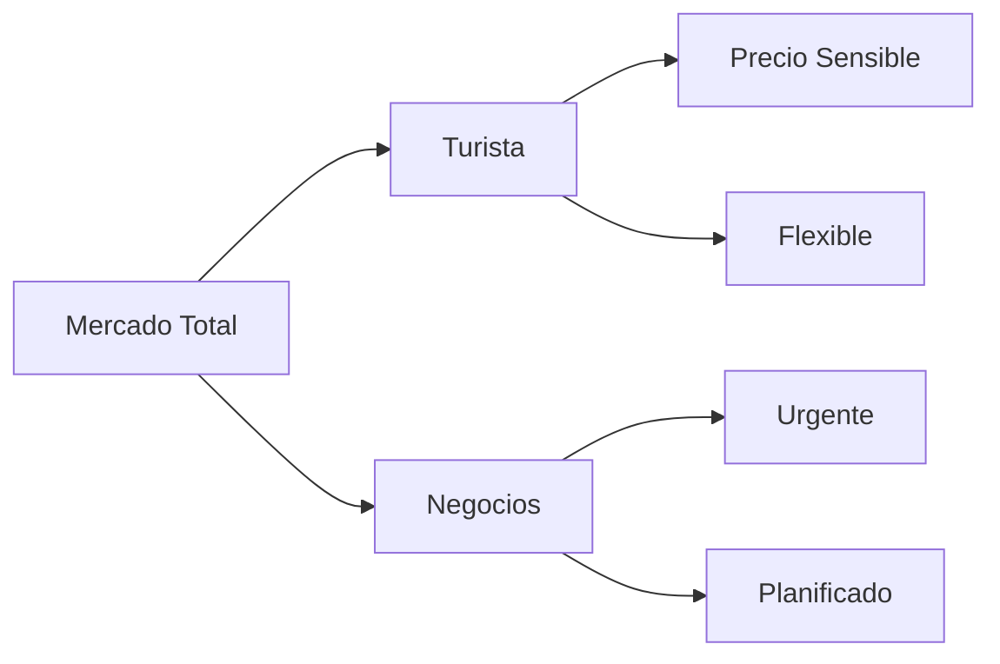
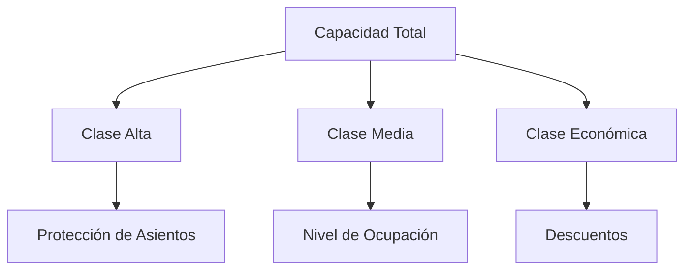

Let me help you create an educational document based on the Revenue Management slides. I'll generate a comprehensive markdown document following your format.

# Clase 18: Revenue Management

## 🎯 Introducción

Revenue Management es como la dirección de una orquesta donde cada instrumento (precio, capacidad, demanda) debe tocar en el momento preciso para crear la mejor sinfonía (maximizar ingresos). Imagina un teatro con asientos limitados - algunos espectadores están dispuestos a comprar entradas con anticipación a precio completo, mientras otros esperan ofertas de último minuto.

### ¿Qué es Revenue Management?

Revenue Management es una estrategia que busca vender el producto correcto, al cliente correcto, en el momento correcto y al precio correcto. Es como un director de tráfico aéreo que debe optimizar el uso de las pistas disponibles.

Características principales:

- **Producto perecible con horizonte de venta fijo**: Los productos o servicios tienen una vida útil limitada y deben venderse antes de una fecha específica.
- **Capacidad fija irreversible**: La capacidad de ofrecer el producto o servicio no puede cambiarse una vez establecida.
- **Demanda estocástica (variable)**: La demanda no es constante y puede variar debido a múltiples factores.
- **Segmentación de demanda por precio**: Diferentes clientes están dispuestos a pagar diferentes precios por el mismo producto o servicio.
- **Capacidad de aceptar o rechazar clientes**: La empresa puede decidir a quién venderle y a quién no, basado en la maximización de ingresos.

> 💡 Dato importante: Revenue Management surgió en la industria aérea tras la desregulación de 1978, generando incrementos típicos de 5-10% en ingresos.

## 📊 Conceptos Principales

### 1. Segmentación de Mercado

La segmentación permite identificar diferentes grupos de clientes con distintas disposiciones a pagar. Esto se logra dividiendo el mercado total en segmentos más pequeños y específicos, cada uno con características y comportamientos de compra únicos.

### 2. Gestión de Capacidad

La gestión de capacidad implica asignar y proteger la capacidad disponible para diferentes segmentos de mercado, asegurando que se maximicen los ingresos. Esto incluye decisiones sobre cuántos asientos, habitaciones o productos reservar para cada segmento.

## 💻 Herramientas y Aplicaciones

### Industrias que aplican RM:

- **Aerolíneas**: Optimización de precios de boletos y gestión de asientos.
- **Hoteles**: Ajuste de tarifas de habitaciones según la demanda.
- **Retail**: Gestión de inventarios y precios de productos perecibles.
- **Telecomunicaciones**: Planificación de tarifas y promociones.
- **Marítima**: Gestión de espacios en barcos y tarifas de carga.
- **Trenes**: Optimización de tarifas y gestión de asientos.
- **Televisión**: Venta de espacios publicitarios según la audiencia.

## 📈 Aplicaciones Prácticas

### Ejemplo 1: Peluquería

- **Un asiento de corte**: Capacidad fija.
- **Precios 20% más altos el sábado**: Mayor demanda.
- **Precios 20% más bajos el martes**: Menor demanda.
- **Resultado**: Reducción de tiempos de espera de 2 horas a 30 minutos y aumento de ventas del 20%.

### Ejemplo 2: Retail

- **Productos perecibles (ej: ropa de temporada)**: Horizonte de venta limitado.
- **Tiempo de reposición: 6 meses**: Ciclo de inventario.
- **Horizonte de venta: 3 meses**: Periodo de venta.
- **Gestión de descuentos según inventario**: Ajuste de precios para maximizar ventas y minimizar pérdidas.

## 🎓 Ejercicio Práctico

Problema de Protección de Asientos:

1. **Capacidad total**: 100 asientos.
2. **Dos clases**: Business (Y) y Económica (Q).
3. **Determinar nivel óptimo de protección para maximizar ingresos**: Decidir cuántos asientos reservar para cada clase para optimizar los ingresos.

## 🔑 Consejos Clave

1. **Monitorear constantemente la demanda y ajustar precios**: Adaptarse a cambios en la demanda.
2. **Segmentar clientes efectivamente**: Identificar y atender diferentes segmentos de mercado.
3. **Mantener sistemas de información actualizados**: Utilizar datos precisos para la toma de decisiones.
4. **Considerar la elasticidad precio-demanda**: Entender cómo los cambios en precios afectan la demanda.
5. **Proteger capacidad para clientes de alto valor**: Reservar capacidad para clientes dispuestos a pagar más.

## 📝 Conclusión

Revenue Management es una herramienta fundamental para optimizar ingresos en industrias con capacidad fija y productos perecibles. Su éxito depende de una correcta segmentación de mercado y una gestión dinámica de precios.

## 📚 Fórmulas Relevantes

Beneficio óptimo esperado:
$$ W(C,T) = \max E[p_1V_1(T) + p_2V_2(T)] $$
donde:

- C = Capacidad disponible
- T = Tiempo
- p = Precio
- V = Volumen de ventas

## 🔍 Recursos Adicionales

- Libro: "Managing the tug-of-war..." por Bitran and Mondshein 1995
- Tesis doctoral: Belobaba 1987, M.I.T.
- Artículo: Weatherford & Bodily 1992, OR(40)5
