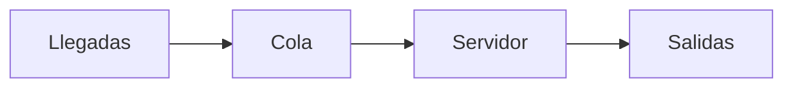
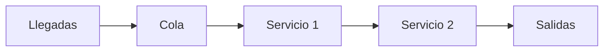
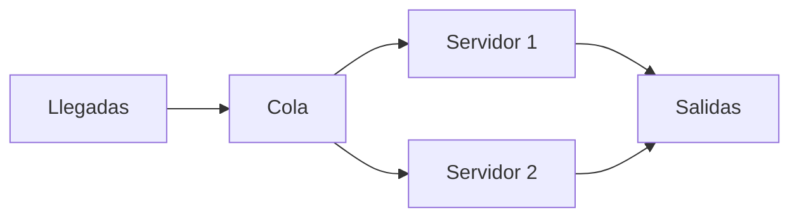

# Clase 20: Programación de Operaciones y Líneas de Espera

## 🎯 Introducción

Imagina que estás en un restaurante de comida rápida durante la hora pico del almuerzo. La fila de clientes crece mientras los cajeros toman y procesan pedidos. Esta situación cotidiana representa perfectamente el concepto de líneas de espera o colas, un elemento fundamental en la programación de operaciones.

Las líneas de espera son una parte inevitable de nuestra vida diaria - desde esperar en el banco hasta hacer fila en el supermercado. Según estudios, las personas destinan entre 2 a 5 años de sus vidas esperando en colas. Entender cómo funcionan y optimizarlas es crucial para mejorar la eficiencia de los sistemas y la satisfacción del cliente.

### ¿Qué son las líneas de espera?

Las líneas de espera o colas son sistemas donde los clientes llegan para recibir un servicio, esperan si el servicio no está disponible inmediatamente, y salen después de ser atendidos.

Características principales:

- Tienen un patrón de llegada de clientes
- Cuentan con uno o más servidores
- Siguen reglas específicas de atención
- Presentan tiempos de servicio variables

> 💡 Dato importante: A.K. Erlang fue el primero en estudiar científicamente las líneas de espera en 1913, analizando el comportamiento de las centrales telefónicas.

## 📊 Conceptos Principales

### Tipos de Sistemas de Líneas de Espera

1. Canal Simple - Una fase

2. Canal Simple - Multi-fase

3. Multi-canal - Una fase

### Parámetros Fundamentales

- λ (lambda): Tasa de llegada de clientes
- μ (mu): Tasa de servicio
- ρ (rho): Utilización del sistema = λ/μ
- Ls: Número promedio de unidades en el sistema
- Lq: Número promedio de unidades en la cola
- Ws: Tiempo promedio en el sistema
- Wq: Tiempo promedio en la cola

## 💻 Métricas y Fórmulas Clave

Para un sistema M/M/1 (llegadas Poisson, servicio exponencial, un servidor):

$$ L_s = \frac{\lambda}{\mu - \lambda} $$
$$ W_s = \frac{1}{\mu - \lambda} $$
$$ L_q = \frac{\lambda^2}{\mu(\mu - \lambda)} $$
$$ W_q = \frac{\lambda}{\mu(\mu - \lambda)} $$
$$ \rho = \frac{\lambda}{\mu} $$

## 📈 Aplicaciones Prácticas

1. Bancos:

   - Clientes llegan para depósitos/retiros
   - Cajeros como servidores
   - Sistema de números para orden de atención

2. Hospitales:
   - Pacientes llegan para atención
   - Doctores como servidores
   - Priorización por gravedad

## 🎓 Ejercicio Práctico

**Problema**: Un banco tiene un cajero que puede atender 20 clientes por hora (μ = 20). Llegan en promedio 15 clientes por hora (λ = 15).

**Calcular**:

1. Utilización del sistema
2. Tiempo promedio en el sistema
3. Número promedio de clientes en cola

**Solución**:

1. ρ = λ/μ = 15/20 = 0.75 (75% utilización)
2. Ws = 1/(μ-λ) = 1/(20-15) = 0.2 horas = 12 minutos
3. Lq = λ²/[μ(μ-λ)] = 15²/[20(20-15)] = 2.25 clientes

## 🔑 Psicología de las Colas

1. El tiempo ocioso se percibe más largo que el tiempo ocupado
2. Las esperas inciertas parecen más largas que las conocidas
3. Las esperas inexplicadas parecen más largas que aquellas con explicación
4. Las esperas injustas se sienten más largas que las justas
5. La ansiedad hace que las esperas parezcan más largas
6. Las esperas individuales se perciben más largas que las grupales

## 📝 Conclusión

La teoría de colas es fundamental para optimizar operaciones y mejorar la experiencia del cliente. El balance entre el costo de servicio y el costo de espera es crucial para un sistema eficiente.

## 📚 Fórmulas Relevantes

### Sistema M/M/1

- Utilización: $\rho = \frac{\lambda}{\mu}$
- Tiempo en sistema: $W_s = \frac{1}{\mu - \lambda}$
- Longitud de cola: $L_q = \frac{\lambda^2}{\mu(\mu - \lambda)}$
- Tiempo en cola: $W_q = \frac{\lambda}{\mu(\mu - \lambda)}$

### Relaciones Generales

- Ley de Little: $L = \lambda W$
- Relación sistema-cola: $W_s = W_q + \frac{1}{\mu}$

## 🔍 Recursos Adicionales

- "Perspectives on Queues: Social Justice and the Psychology of Queueing" por R. Larson
- "Queueing Theory" por V.G. Narayanan
