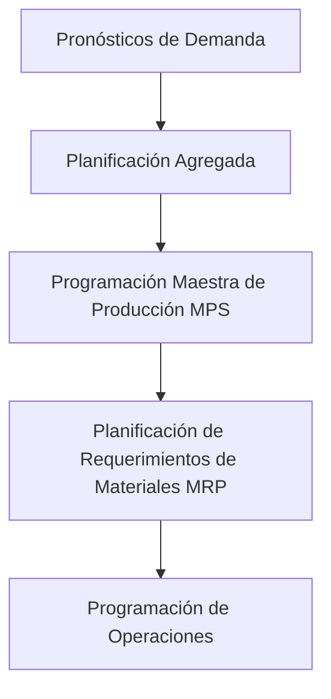
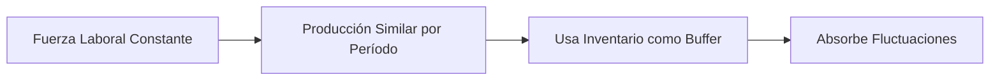
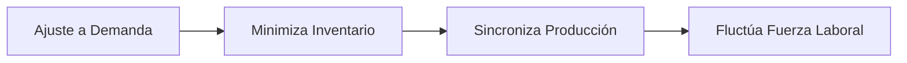

# Clase 22: Planificación Agregada

## 🎯 Introducción

La planificación agregada es como dirigir una orquesta empresarial donde debemos coordinar múltiples elementos (producción, inventario, fuerza laboral) para crear una sinfonía operativa perfecta. Así como un director debe decidir cuántos músicos necesita y cómo distribuir los ensayos, las empresas deben determinar cómo utilizar sus recursos para satisfacer la demanda de manera eficiente.

### ¿Qué es la Planificación Agregada?

La planificación agregada es un proceso de toma de decisiones que especifica la combinación óptima de:

- Nivel de recursos humanos
- Tasa de producción
- Niveles de inventario

> 💡 Dato importante: La planificación agregada trabaja en un horizonte de mediano plazo (6 a 18 meses) y considera grupos de productos o categorías amplias.

## 📊 Conceptos Principales

### Jerarquía de Decisiones de Producción

### Opciones Basadas en la Demanda

1. **Inventario de Productos Terminados**

   - Permite absorber fluctuaciones en la demanda
   - Actúa como amortiguador entre producción y demanda

2. **Faltante**

   - Implica retraso en despacho
   - Puede afectar la satisfacción del cliente

3. **Ajuste vía Precios**
   - Desplaza demanda a períodos no peak
   - Utiliza publicidad y promociones como herramientas

### Opciones Basadas en la Capacidad

1. **Sobretiempo**

   - Opción de corto plazo
   - Requiere pago de bonos por horas extras

2. **Bajotiempo**

   - Opción de corto plazo
   - Implica reducción de tasa de producción

3. **Subcontratación**

   - Opción de mediano plazo
   - Permite mantener flexibilidad

4. **Contratación y Despido**
   - Opción de largo plazo
   - Modifica tamaño de fuerza laboral

## 💻 Estrategias de Planificación

### Plan de Nivel (Level)

Ventajas:

- Flujo constante de operaciones
- Mejor moral del personal
- Mayor estabilidad

### Plan de Ajuste (Chase)

## 📈 Modelo Matemático Básico

Para T períodos, m productos y n centros de trabajo:

$Min \sum_{t=1}^{T} (\sum_{j=1}^{m} (c_{jt}x_{jt} + I_{jt}h_j) + \sum_{i=1}^{n} y_{it}f_i)$

Sujeto a:

- $\sum_{j=1}^{m} a_{ij}x_{jt} \leq b_{it} + y_{it} \forall i,t$
- $I_{jt} = I_{j,t-1} + x_{jt} - d_{jt} \forall j,t$
- $x_{jt}, I_{jt}, y_{it} \geq 0 \forall j,t,i$

## 🎓 Ejercicio Práctico

[Ejemplo con los datos numéricos mostrados en las diapositivas 16 y 18]

## 🔑 Consejos Clave

1. Evaluar el plan agregado desde múltiples perspectivas:

   - Operaciones
   - Recursos Humanos
   - Marketing
   - Finanzas

2. Considerar criterios no financieros:

   - Capacidad operacional
   - Moral del personal
   - Satisfacción del cliente

3. Balancear costos versus flexibilidad

## 📝 Conclusión

La planificación agregada es una herramienta fundamental para equilibrar recursos y demanda en el mediano plazo. El éxito radica en elegir la estrategia adecuada según el contexto empresarial y mantener un balance entre costos, capacidad y servicio al cliente.

## 📚 Fórmulas Relevantes

### Variables

- $x_{jt}$: Producción del producto j en t
- $I_{jt}$: Inventario del producto j en t
- $y_{it}$: Horas contratadas de sobretiempo

### Parámetros

- $d_{jt}$: Demanda por producto j en período t
- $f_i$: Costo de hora de sobretiempo en centro i
- $h_j$: Costo de inventario para producto j
- $b_{it}$: Horas totales disponibles
- $a_{ij}$: Tiempo requerido del centro i para producto j
- $c_{jt}$: Costo unitario de fabricación

## 🔍 Recursos Adicionales

- Modelos de programación matemática aplicados en:
  - CTI
  - Sodimac
  - Tottus
  - D&S-Walmart
