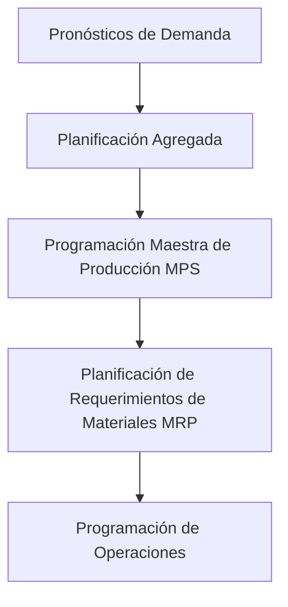
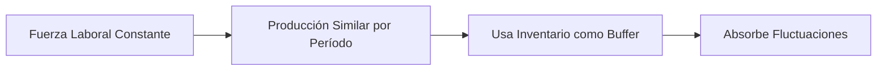
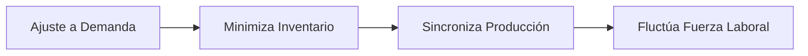

# Clase 22: Planificación Agregada

## 🎯 Introducción

La planificación agregada es como dirigir una orquesta empresarial donde debemos coordinar múltiples elementos (producción, inventario, fuerza laboral) para crear una sinfonía operativa perfecta. Así como un director debe decidir cuántos músicos necesita y cómo distribuir los ensayos, las empresas deben determinar cómo utilizar sus recursos para satisfacer la demanda de manera eficiente. Este proceso es crucial para mantener un equilibrio entre la oferta y la demanda, minimizando costos y maximizando la eficiencia operativa.

### ¿Qué es la Planificación Agregada?

La planificación agregada es un proceso de toma de decisiones que especifica la combinación óptima de:

- **Nivel de recursos humanos**: Determina la cantidad de personal necesario para cumplir con los objetivos de producción.
- **Tasa de producción**: Define la cantidad de productos que deben ser fabricados en un período específico.
- **Niveles de inventario**: Establece la cantidad de productos terminados que deben mantenerse en inventario para satisfacer la demanda futura.

> 💡 Dato importante: La planificación agregada trabaja en un horizonte de mediano plazo (6 a 18 meses) y considera grupos de productos o categorías amplias. Esto permite a las empresas ajustar sus estrategias de producción y recursos de manera flexible y eficiente.

## 📊 Conceptos Principales

### Jerarquía de Decisiones de Producción

La jerarquía de decisiones de producción es un enfoque estructurado que ayuda a las empresas a planificar y coordinar sus actividades de producción de manera eficiente. Este enfoque se puede visualizar como una serie de decisiones interrelacionadas que comienzan con los pronósticos de demanda y culminan en la programación de operaciones diarias.

### Opciones Basadas en la Demanda

1. **Inventario de Productos Terminados**

   - Permite absorber fluctuaciones en la demanda, actuando como un amortiguador entre la producción y la demanda real del mercado.
   - Mantener un inventario adecuado puede prevenir la pérdida de ventas y mejorar la satisfacción del cliente.

2. **Faltante**

   - Implica retraso en despacho, lo que puede afectar negativamente la satisfacción del cliente y la reputación de la empresa.
   - Es crucial gestionar los faltantes de manera eficiente para minimizar su impacto.

3. **Ajuste vía Precios**

   - Desplaza la demanda a períodos no peak mediante el uso de estrategias de precios, publicidad y promociones.
   - Esta opción puede ayudar a equilibrar la carga de trabajo y optimizar el uso de recursos.

### Opciones Basadas en la Capacidad

1. **Sobretiempo**

   - Es una opción de corto plazo que permite aumentar la producción sin necesidad de contratar más personal.
   - Requiere el pago de bonos por horas extras, lo que puede incrementar los costos laborales.

2. **Bajotiempo**

   - También es una opción de corto plazo que implica la reducción de la tasa de producción.
   - Puede ser útil en períodos de baja demanda para evitar la acumulación de inventario.

3. **Subcontratación**

   - Es una opción de mediano plazo que permite a las empresas mantener flexibilidad al externalizar parte de la producción.
   - Puede ser una solución efectiva para manejar picos de demanda sin incurrir en costos fijos adicionales.

4. **Contratación y Despido**

   - Es una opción de largo plazo que modifica el tamaño de la fuerza laboral según las necesidades de producción.
   - Aunque puede ser costosa y afectar la moral del personal, es necesaria para ajustar la capacidad a largo plazo.

## 💻 Estrategias de Planificación

### Plan de Nivel (Level)

El plan de nivel se basa en mantener una fuerza laboral constante y una producción similar en cada período, utilizando el inventario como buffer para absorber las fluctuaciones en la demanda.

Ventajas:

- Flujo constante de operaciones, lo que facilita la planificación y la gestión de la producción.
- Mejor moral del personal debido a la estabilidad laboral.
- Mayor estabilidad en los costos operativos.

### Plan de Ajuste (Chase)

El plan de ajuste se enfoca en sincronizar la producción con la demanda, minimizando el inventario y ajustando la fuerza laboral según las necesidades.

Ventajas:

- Reducción de costos de inventario al producir solo lo necesario para satisfacer la demanda.
- Mayor flexibilidad para adaptarse a cambios en la demanda del mercado.
- Optimización de recursos al ajustar la producción en función de las necesidades reales.

## 📈 Modelo Matemático Básico

Para T períodos, m productos y n centros de trabajo:

$Min \sum_{t=1}^{T} (\sum_{j=1}^{m} (c_{jt}x_{jt} + I_{jt}h_j) + \sum_{i=1}^{n} y_{it}f_i)$

Sujeto a:

- $\sum_{j=1}^{m} a_{ij}x_{jt} \leq b_{it} + y_{it} \forall i,t$
- $I_{jt} = I_{j,t-1} + x_{jt} - d_{jt} \forall j,t$
- $x_{jt}, I_{jt}, y_{it} \geq 0 \forall j,t,i$

Este modelo matemático ayuda a las empresas a determinar la combinación óptima de producción, inventario y horas de sobretiempo para minimizar los costos totales mientras se satisfacen las restricciones de capacidad y demanda.

## 🎓 Ejercicio Práctico

[Ejemplo con los datos numéricos mostrados en las diapositivas 16 y 18]

## 🔑 Consejos Clave

1. Evaluar el plan agregado desde múltiples perspectivas:

   - **Operaciones**: Asegurar que el plan sea factible y eficiente desde el punto de vista operativo.
   - **Recursos Humanos**: Considerar el impacto en la moral y la productividad del personal.
   - **Marketing**: Alinear el plan con las estrategias de marketing y las expectativas del cliente.
   - **Finanzas**: Evaluar el impacto financiero y asegurar que el plan sea rentable.

2. Considerar criterios no financieros:

   - **Capacidad operacional**: Asegurar que la empresa tenga la capacidad necesaria para cumplir con el plan.
   - **Moral del personal**: Mantener un ambiente de trabajo positivo y motivador.
   - **Satisfacción del cliente**: Garantizar que el plan cumpla con las expectativas del cliente en términos de calidad y tiempo de entrega.

3. Balancear costos versus flexibilidad:

   - Evaluar el costo de mantener inventarios altos versus la flexibilidad de ajustar la producción según la demanda.
   - Considerar el impacto de las decisiones de planificación en la capacidad de la empresa para responder a cambios en el mercado.

## 📝 Conclusión

La planificación agregada es una herramienta fundamental para equilibrar recursos y demanda en el mediano plazo. El éxito radica en elegir la estrategia adecuada según el contexto empresarial y mantener un balance entre costos, capacidad y servicio al cliente. Una planificación efectiva puede mejorar la eficiencia operativa, reducir costos y aumentar la satisfacción del cliente.

## 📚 Fórmulas Relevantes

### Variables

- $x_{jt}$: Producción del producto j en t
- $I_{jt}$: Inventario del producto j en t
- $y_{it}$: Horas contratadas de sobretiempo

### Parámetros

- $d_{jt}$: Demanda por producto j en período t
- $f_i$: Costo de hora de sobretiempo en centro i
- $h_j$: Costo de inventario para producto j
- $b_{it}$: Horas totales disponibles
- $a_{ij}$: Tiempo requerido del centro i para producto j
- $c_{jt}$: Costo unitario de fabricación

## 🔍 Recursos Adicionales

- Modelos de programación matemática aplicados en:
  - CTI
  - Sodimac
  - Tottus
  - D&S-Walmart
