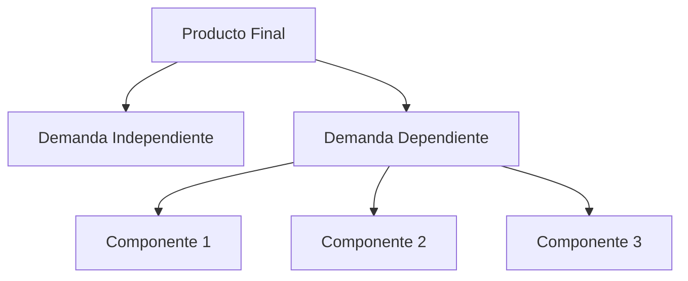
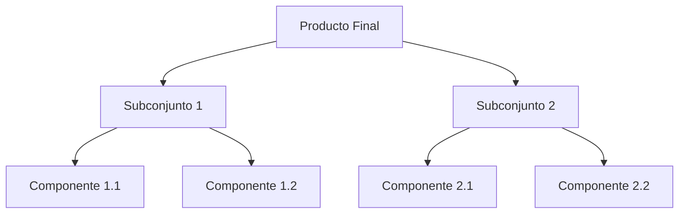
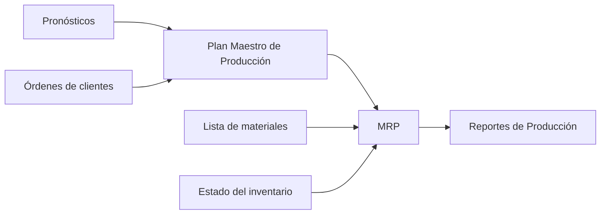

# Clase 24: Planificación de Corto Plazo - MRP

## 🎯 Introducción

La planificación de materiales en manufactura es como organizar los ingredientes para una receta a gran escala. Así como un chef debe asegurar tener todos los ingredientes necesarios en el momento preciso para preparar múltiples platos simultáneamente, las empresas manufactureras necesitan coordinar la disponibilidad de múltiples componentes para sus productos. Esta coordinación es crucial para evitar retrasos en la producción y asegurar que los productos finales se entreguen a tiempo.

### ¿Qué es MRP?

El Material Requirements Planning (MRP) es un sistema de información computacional desarrollado en los años 60 por J. Orlicky y otros en IBM. Este sistema ayuda a las empresas a determinar:

- Qué componentes se necesitan producir
- Cuántos se necesitan
- Cuándo se necesitan para cumplir con la demanda

> 💡 Dato importante: MRP se basa en el concepto de demanda dependiente, donde la necesidad de componentes está directamente relacionada con la demanda de productos finales. Esto significa que la producción de componentes está sincronizada con la producción de los productos finales, optimizando así el uso de recursos y minimizando el inventario.

## 📊 Conceptos Principales

### Demanda Independiente vs. Dependiente

La demanda independiente se refiere a la demanda de productos finales que no depende de la producción de otros productos. Por ejemplo, la demanda de un automóvil es independiente. En cambio, la demanda dependiente se refiere a la demanda de componentes que son necesarios para producir un producto final. Por ejemplo, la demanda de neumáticos es dependiente de la demanda de automóviles.

### Plan Maestro de Producción (MPS)

El Plan Maestro de Producción (MPS) es un documento dinámico que determina:

- Cuándo producir cada producto final
- En qué cantidad producirlo
- Cómo cumplir con los compromisos de entrega

El MPS es esencial para asegurar que la producción se alinee con la demanda del mercado y que los recursos de la empresa se utilicen de manera eficiente.

### Lista de Materiales (BOM)

La Lista de Materiales (BOM) es una estructura jerárquica que desglosa un producto final en todos sus componentes y subcomponentes. Es esencial para el MRP ya que define qué materiales y componentes se necesitan para fabricar un producto.

## 💻 Elementos del Sistema MRP

El sistema MRP integra varios elementos clave para planificar y controlar la producción:

- **Pronósticos**: Estimaciones de la demanda futura.
- **Órdenes de clientes**: Pedidos reales que deben cumplirse.
- **Plan Maestro de Producción (MPS)**: Plan detallado de producción.
- **Lista de Materiales (BOM)**: Desglose de componentes necesarios.
- **Estado del inventario**: Información sobre las existencias actuales.
- **MRP**: Sistema que procesa toda esta información para generar órdenes de producción y compras.
- **Reportes de Producción**: Informes que ayudan a monitorear y controlar la producción.

## 📈 Cálculos Principales

### Requerimientos Netos

Los requerimientos netos son la cantidad de componentes que se necesitan después de considerar el inventario disponible y las recepciones programadas.

$$ RN = RB - (R + I) $$

Donde:

- RN = Requerimientos Netos
- RB = Requerimientos Brutos
- R = Recepciones Programadas
- I = Inventario en Mano

## 🔑 Técnicas de Loteo

1. **Lote a Lote (L4L)**

   - Minimiza el costo de inventario
   - Produce exactamente lo necesario para cumplir con la demanda inmediata

2. **Cantidad Económica de Pedido (EOQ)**
   - Balance entre costos de preparación e inventario
     $$ Q = \sqrt{\frac{2DS}{H}} $$
     Donde:
   - D = Demanda
   - S = Costo de preparación
   - H = Costo de mantención

## 📝 Conclusión

El MRP ha evolucionado hacia sistemas más completos y sofisticados:

1. **MRP II**: Incorpora capacidad y recursos adicionales, permitiendo una planificación más detallada y precisa.
2. **ERP**: Sistema integral que incluye todas las áreas de la empresa, desde la producción hasta la contabilidad y la gestión de recursos humanos.

## 🔍 Limitaciones del MRP

- **Modelo determinístico**: Asume que la demanda y los tiempos de entrega son conocidos y constantes.
- **Sistema Push**: Produce según un plan predeterminado, lo que puede llevar a excesos de inventario.
- **Grandes requerimientos de datos**: Necesita información precisa y actualizada para funcionar correctamente.
- **Costos significativos de implementación y mantenimiento**: Requiere una inversión considerable en tecnología y capacitación.

## 📚 Sistemas Modernos (ERP)

Los sistemas ERP actuales integran todas las áreas de la empresa, proporcionando una visión holística y mejorando la eficiencia operativa. Incluyen módulos para:

- Ventas y comercialización
- Contabilidad y finanzas
- Manejo de personas
- Operaciones y logística

> 💡 Ejemplos de ERP modernos: SAP, Oracle, SAGE, IFS

Estos sistemas permiten a las empresas responder rápidamente a los cambios en la demanda y optimizar sus procesos internos, mejorando así su competitividad en el mercado.
