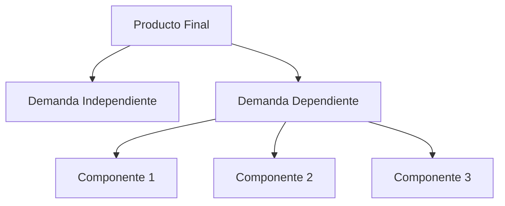
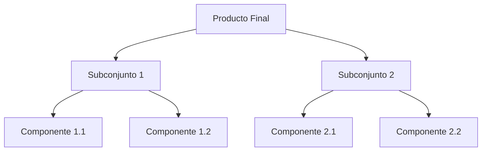
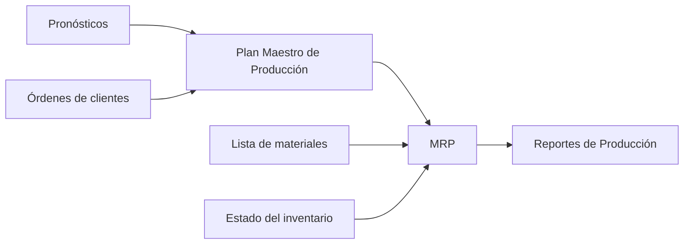

# Clase 24: Planificación de Corto Plazo - MRP

## 🎯 Introducción

La planificación de materiales en manufactura es como organizar los ingredientes para una receta a gran escala. Así como un chef debe asegurar tener todos los ingredientes necesarios en el momento preciso para preparar múltiples platos simultáneamente, las empresas manufactureras necesitan coordinar la disponibilidad de múltiples componentes para sus productos.

### ¿Qué es MRP?

El Material Requirements Planning (MRP) es un sistema de información computacional desarrollado en los años 60 por J. Orlicky y otros en IBM, que ayuda a las empresas a determinar:

- Qué componentes se necesitan producir
- Cuántos se necesitan
- Cuándo se necesitan para cumplir con la demanda

> 💡 Dato importante: MRP se basa en el concepto de demanda dependiente, donde la necesidad de componentes está directamente relacionada con la demanda de productos finales.

## 📊 Conceptos Principales

### Demanda Independiente vs. Dependiente

### Plan Maestro de Producción (MPS)

El MPS es un documento dinámico que determina:

- Cuándo producir cada producto final
- En qué cantidad producirlo
- Cómo cumplir con los compromisos de entrega

### Lista de Materiales (BOM)

## 💻 Elementos del Sistema MRP

## 📈 Cálculos Principales

### Requerimientos Netos

$$ RN = RB - (R + I) $$
Donde:

- RN = Requerimientos Netos
- RB = Requerimientos Brutos
- R = Recepciones Programadas
- I = Inventario en Mano

## 🔑 Técnicas de Loteo

1. Lote a Lote (L4L)

   - Minimiza costo de inventario
   - Produce exactamente lo necesario

2. Cantidad Económica de Pedido (EOQ)
   - Balance entre costos de preparación e inventario
     $$ Q = \sqrt{\frac{2DS}{H}} $$
     Donde:
   - D = Demanda
   - S = Costo de preparación
   - H = Costo de mantención

## 📝 Conclusión

El MRP evolucionó hacia sistemas más completos:

1. MRP II: Incorpora capacidad y recursos adicionales
2. ERP: Sistema integral que incluye todas las áreas de la empresa

## 🔍 Limitaciones del MRP

- Modelo determinístico
- Sistema Push
- Grandes requerimientos de datos
- Costos significativos de implementación y mantenimiento

## 📚 Sistemas Modernos (ERP)

Los sistemas actuales integran:

- Ventas y comercialización
- Contabilidad y finanzas
- Manejo de personas
- Operaciones y logística

> 💡 Ejemplos de ERP modernos: SAP, Oracle, SAGE, IFS
