# Clase 25: Manejo de Calidad Total

## 🎯 Introducción

El manejo de calidad total (TQM) es como la dirección de una orquesta sinfónica, donde cada músico, instrumento y nota debe funcionar en perfecta armonía para crear una experiencia excepcional. Al igual que un director de orquesta coordina múltiples elementos para lograr una interpretación perfecta, el TQM coordina todos los aspectos de una organización para alcanzar la excelencia operativa y la satisfacción del cliente.

### 쯈ué es la Calidad?

La calidad puede definirse desde múltiples perspectivas:

- **Cumplimiento de especificaciones**: Como un rompecabezas donde cada pieza debe encajar perfectamente según el diseño. Por ejemplo, las dimensiones de una pieza mecánica deben estar dentro de las tolerancias especificadas.
- **Propósito de uso**: El producto cumple efectivamente la función para la que fue creado. Un buen paraguas debe mantener seco al usuario, ser fácil de abrir/cerrar y resistente al viento.
- **Valor por precio pagado**: La utilidad justifica la inversión realizada. Un producto de calidad ofrece beneficios que el cliente percibe como superiores a su costo.
- **Servicio post-venta**: El respaldo después de la compra, incluyendo garantía, mantenimiento y soporte técnico.
- **Criterio psicológico**: La percepción subjetiva de excelencia, influenciada por la marca, el diseño y la experiencia del usuario.

> 💡 Dato importante: La calidad no es solo responsabilidad del departamento de calidad, es una filosofía que debe permear toda la organización, desde el CEO hasta el personal de primera línea.

## 📊 Conceptos Principales

### Manufactura vs. Servicios

La calidad se manifiesta de manera diferente en manufactura y servicios:

**Manufactura**:

- Características medibles y especificaciones precisas
- Control estadístico del proceso
- Productos físicos que pueden ser inspeccionados
- Defectos son identificables y cuantificables
- Procesos repetitivos y estandarizables

**Servicios**:

- Experiencias intangibles y personalizadas
- Variabilidad inherente al factor humano
- Producción y consumo simultáneos
- Calidad basada en percepciones
- Mayor dificultad para estandarizar

```mermaid
graph TB
    A[Calidad] --> B[Manufactura]
    A --> C[Servicios]
    B --> D[Características Tangibles]
    D --> E[Especificaciones]
    D --> F[Desempeño]
    D --> G[Confiabilidad]
    C --> H[Factores Perceptivos]
    H --> I[Cortesía]
    H --> J[Amabilidad]
    H --> K[Atmósfera]
```

### Evolución del Concepto de Calidad

La calidad ha evolucionado significativamente a lo largo del tiempo:

> 💡 Nota: Cada era construyó sobre los avances de la anterior, creando un enfoque cada vez más integral hacia la calidad.

### Filosofía TQM

1. Mantener el enfoque en el cliente
2. Mejoramiento continuo (kaizen)
3. Calidad en la fuente
4. Empoderamiento de empleados
5. Enfoque en clientes internos y externos

## 💻 Herramientas de Control de Calidad

1. Diagramas causa-efecto (Ishikawa)
2. Diagramas de flujo
3. Listas de chequeo
4. Diagramas de control
5. Diagramas de puntos
6. Diagramas de Pareto
7. Histogramas

### Costos de Calidad

```mermaid
graph LR
    A[Costos de Calidad] --> B[Preventivos]
    A --> C[Búsqueda]
    A --> D[Falla Interna]
    A --> E[Falla Externa]
    B --> F[Entrenamiento/Diseño]
    C --> G[Inspecciones/Pruebas]
    D --> H[Desperdicios/Retrabajo]
    E --> I[Garantías/Devoluciones]
```

## 📈 Aplicaciones Prácticas

### Ejemplo 1: Control de Calidad en Manufactura Automotriz

- Implementación de sistemas QS 9000
- Medición de defectos por cada 100 vehículos
- Control de horas-hombre por vehículo

### Ejemplo 2: Servicio al Cliente en Banca

- Medición de tiempos de espera
- Evaluación de satisfacción del cliente
- Seguimiento de resolución de reclamos

## 🎓 Ejercicio Práctico

Análisis de Costos de Calidad:

1. Identificar costos preventivos actuales
2. Calcular costos de fallas
3. Determinar punto óptimo de inversión en calidad

## 🔑 Consejos Clave

1. La calidad debe ser construida en el proceso, no inspeccionada después
2. El mejoramiento continuo es un ciclo sin fin
3. El compromiso debe venir desde la alta dirección
4. La prevención es más económica que la corrección

## 📝 Conclusión

El TQM es una filosofía integral que requiere el compromiso de toda la organización. Al igual que una orquesta necesita que todos sus miembros estén sincronizados, el TQM necesita que todos los elementos de la organización trabajen en armonía hacia la excelencia.

## 📚 Estándares y Certificaciones

1. ISO 9001:2015

   - Estándares internacionales de calidad
   - Certificación periódica
   - Aplicable a múltiples industrias

2. ISO 14001:2004

   - Enfoque en gestión ambiental
   - Medición de impacto ambiental
   - Responsabilidad corporativa

3. Malcolm Baldrige National Quality Award
   - Premio nacional de calidad en EEUU
   - Evalúa excelencia organizacional
   - Categorías múltiples de evaluación

## 🔍 Gurús de la Calidad

1. W. Edwards Deming (1900-1993)

   - Ciclo PDCA
   - 14 principios gerenciales
   - Control estadístico de procesos

2. Joseph Juran (1904-2008)

   - Trilogía de la calidad
   - Enfoque en costos de calidad
   - Calidad como propósito de uso

3. Phillip Crosby (1926-2001)
   - Concepto de "cero defectos"
   - "La calidad es gratis"
   - Énfasis en prevención
