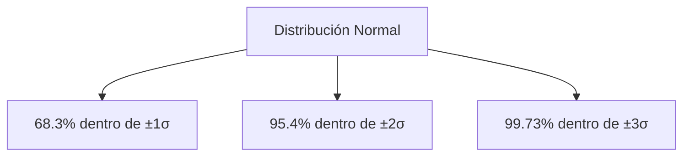

# Clase 27: Control Estadístico de Procesos

## 🎯 Introducción

El Control Estadístico de Procesos (SPC) es una metodología que utiliza herramientas estadísticas para monitorear y controlar un proceso. Al igual que un termómetro mide la temperatura de un paciente para evaluar su salud, el SPC mide la "salud" de los procesos productivos. Esto permite identificar y corregir problemas antes de que se conviertan en defectos graves.

### ¿Qué es el Control Estadístico de Procesos?

El SPC es un conjunto de técnicas estadísticas que ayudan a:

- **Monitorear el comportamiento de los procesos:** Permite observar cómo se desempeñan los procesos a lo largo del tiempo.
- **Detectar variaciones anormales:** Identifica desviaciones que pueden indicar problemas en el proceso.
- **Mantener la calidad del producto dentro de límites aceptables:** Asegura que los productos cumplan con los estándares de calidad establecidos.

> 💡 El SPC es una parte integral del TQM (Total Quality Management) y se centra en la prevención de defectos en lugar de su detección.

## 📊 Conceptos Principales

### 1. Estadísticas Descriptivas

Las estadísticas descriptivas son herramientas básicas que nos permiten resumir y describir las características de un conjunto de datos.

#### Media (x̄)

La media es el promedio de un conjunto de datos y se calcula sumando todos los valores y dividiéndolos por el número total de valores.

$$ \bar{x} = \frac{1}{n}\sum\_{i=1}^n x_i $$

Es el punto de equilibrio de nuestros datos, representando el valor central.

#### Desviación Estándar (σ)

La desviación estándar mide la dispersión de los datos alrededor de la media. Indica cuánto varían los datos respecto a la media.

$$ \sigma = \sqrt{\frac{1}{n-1}\sum\_{i=1}^{n}(x_i - \bar{x})^2} $$

Una desviación estándar baja indica que los datos están cerca de la media, mientras que una alta indica mayor dispersión.

### 2. La Distribución Normal

La distribución normal, también conocida como curva de Gauss, es una distribución de probabilidad que es simétrica respecto a la media. La mayoría de los datos se agrupan alrededor de la media, y la probabilidad de valores extremos disminuye a medida que nos alejamos de la media.



### 3. Capacidad del Proceso

La capacidad del proceso mide la habilidad de un proceso para producir resultados dentro de los límites especificados.

#### Índices de Capacidad

- **Cp (Proceso centrado):** Mide la capacidad del proceso asumiendo que está centrado entre los límites de especificación.

  $$ C_p = \frac{USL - LSL}{6\sigma} $$

- **Cpk (Cualquier proceso):** Mide la capacidad del proceso teniendo en cuenta su centrado. Es el menor valor entre la capacidad del proceso respecto al límite superior y al límite inferior.

  $$ C\_{pk} = \min(\frac{USL-\mu}{3\sigma}, \frac{\mu-LSL}{3\sigma}) $$

## 💻 Herramientas de Control

### 1. Diagramas de Control

Los diagramas de control son gráficos utilizados para estudiar cómo cambia un proceso a lo largo del tiempo. Incluyen:

- **Límites de control superior (UCL):** El límite superior dentro del cual se espera que caigan la mayoría de los puntos de datos.
- **Línea central (CL):** Representa la media del proceso.
- **Límites de control inferior (LCL):** El límite inferior dentro del cual se espera que caigan la mayoría de los puntos de datos.

## 📈 Aplicaciones Prácticas

### Ejemplo: Proceso de Embotellado

Datos de muestra:

```
Muestra 1: 15.8, 16.0, 15.8, 15.9
Muestra 2: 16.1, 16.0, 15.8, 15.9
Muestra 3: 16.0, 15.9, 15.9, 15.8
```

## 🎓 Ejercicio Práctico

### Cálculo de Límites de Control

1. Calcular la media general:
   $$ \bar{\bar{x}} = \frac{15.875 + 15.975 + 15.9}{3} = 15.92 $$

2. Calcular límites (σ = 0.2):

- UCL = 15.92 + 3(0.2/√4) = 16.22
- LCL = 15.92 - 3(0.2/√4) = 15.62

## 🔑 Puntos Clave para el Control de Calidad

1. Tomar acción cuando:

- Un punto cae fuera de los límites de control
- Siete puntos consecutivos en un mismo lado de la línea central
- Tendencias consistentes hacia arriba o abajo
- Patrones no aleatorios

## 📝 Conclusión

El SPC es fundamental para:

- Mantener procesos bajo control
- Reducir variabilidad
- Mejorar calidad del producto
- Prevenir defectos

## 📚 Fórmulas Relevantes

### Estadísticas Básicas

1. Media muestral: $\bar{x} = \frac{1}{n}\sum_{i=1}^n x_i$
2. Desviación estándar: $\sigma = \sqrt{\frac{1}{n-1}\sum_{i=1}^{n}(x_i - \bar{x})^2}$

### Índices de Capacidad

1. Cp: $C_p = \frac{USL - LSL}{6\sigma}$
2. Cpk: $C_{pk} = \min(\frac{USL-\mu}{3\sigma}, \frac{\mu-LSL}{3\sigma})$

### Límites de Control

1. UCL = $\bar{x} + z\sigma_{\bar{x}}$
2. LCL = $\bar{x} - z\sigma_{\bar{x}}$

## 🔍 Métricas de Calidad Six Sigma

- 3σ: 2,700 defectos por millón
- 4σ: 63 defectos por millón
- 5σ: 0.57 defectos por millón
- 6σ: 0.002 defectos por millón
