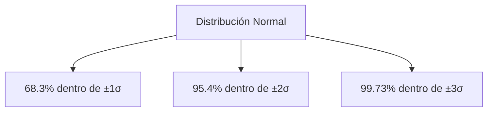

# Clase 27: Control Estadístico de Procesos

## 🎯 Introducción

El Control Estadístico de Procesos (SPC) es como tener un termómetro que mide constantemente la "salud" de nuestros procesos productivos. Así como un médico utiliza diferentes medidas para evaluar el estado de un paciente, el SPC nos proporciona herramientas estadísticas para monitorear y mejorar la calidad de nuestros procesos.

### ¿Qué es el Control Estadístico de Procesos?

El SPC es un conjunto de herramientas estadísticas que nos ayudan a:

- Monitorear el comportamiento de los procesos
- Detectar variaciones anormales
- Mantener la calidad del producto dentro de límites aceptables

> 💡 El SPC es parte fundamental del TQM (Total Quality Management) y se enfoca en prevenir defectos en lugar de detectarlos.

## 📊 Conceptos Principales

### 1. Estadísticas Descriptivas

Las estadísticas descriptivas son nuestras herramientas básicas de medición:

#### Media (x̄)

$$ \bar{x} = \frac{1}{n}\sum\_{i=1}^n x_i $$

Es el centro de gravedad de nuestros datos, el punto de equilibrio.

#### Desviación Estándar (σ)

$$ \sigma = \sqrt{\frac{1}{n-1}\sum\_{i=1}^{n}(x_i - \bar{x})^2} $$

Mide qué tan dispersos están los datos alrededor de la media.

### 2. La Distribución Normal



### 3. Capacidad del Proceso

#### Índices de Capacidad

- Cp (Proceso centrado):
  $$ C_p = \frac{USL - LSL}{6\sigma} $$

- Cpk (Cualquier proceso):
  $$ C\_{pk} = \min(\frac{USL-\mu}{3\sigma}, \frac{\mu-LSL}{3\sigma}) $$

## 💻 Herramientas de Control

### 1. Diagramas de Control

- Límites de control superior (UCL)
- Línea central (CL)
- Límites de control inferior (LCL)

## 📈 Aplicaciones Prácticas

### Ejemplo: Proceso de Embotellado

Datos de muestra:

```
Muestra 1: 15.8, 16.0, 15.8, 15.9
Muestra 2: 16.1, 16.0, 15.8, 15.9
Muestra 3: 16.0, 15.9, 15.9, 15.8
```

## 🎓 Ejercicio Práctico

### Cálculo de Límites de Control

1. Calcular la media general:
   $$ \bar{\bar{x}} = \frac{15.875 + 15.975 + 15.9}{3} = 15.92 $$

2. Calcular límites (σ = 0.2):

- UCL = 15.92 + 3(0.2/√4) = 16.22
- LCL = 15.92 - 3(0.2/√4) = 15.62

## 🔑 Puntos Clave para el Control de Calidad

1. Tomar acción cuando:

- Un punto cae fuera de los límites de control
- Siete puntos consecutivos en un mismo lado de la línea central
- Tendencias consistentes hacia arriba o abajo
- Patrones no aleatorios

## 📝 Conclusión

El SPC es fundamental para:

- Mantener procesos bajo control
- Reducir variabilidad
- Mejorar calidad del producto
- Prevenir defectos

## 📚 Fórmulas Relevantes

### Estadísticas Básicas

1. Media muestral: $\bar{x} = \frac{1}{n}\sum_{i=1}^n x_i$
2. Desviación estándar: $\sigma = \sqrt{\frac{1}{n-1}\sum_{i=1}^{n}(x_i - \bar{x})^2}$

### Índices de Capacidad

1. Cp: $C_p = \frac{USL - LSL}{6\sigma}$
2. Cpk: $C_{pk} = \min(\frac{USL-\mu}{3\sigma}, \frac{\mu-LSL}{3\sigma})$

### Límites de Control

1. UCL = $\bar{x} + z\sigma_{\bar{x}}$
2. LCL = $\bar{x} - z\sigma_{\bar{x}}$

## 🔍 Métricas de Calidad Six Sigma

- 3σ: 2,700 defectos por millón
- 4σ: 63 defectos por millón
- 5σ: 0.57 defectos por millón
- 6σ: 0.002 defectos por millón
