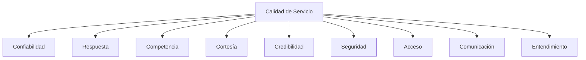
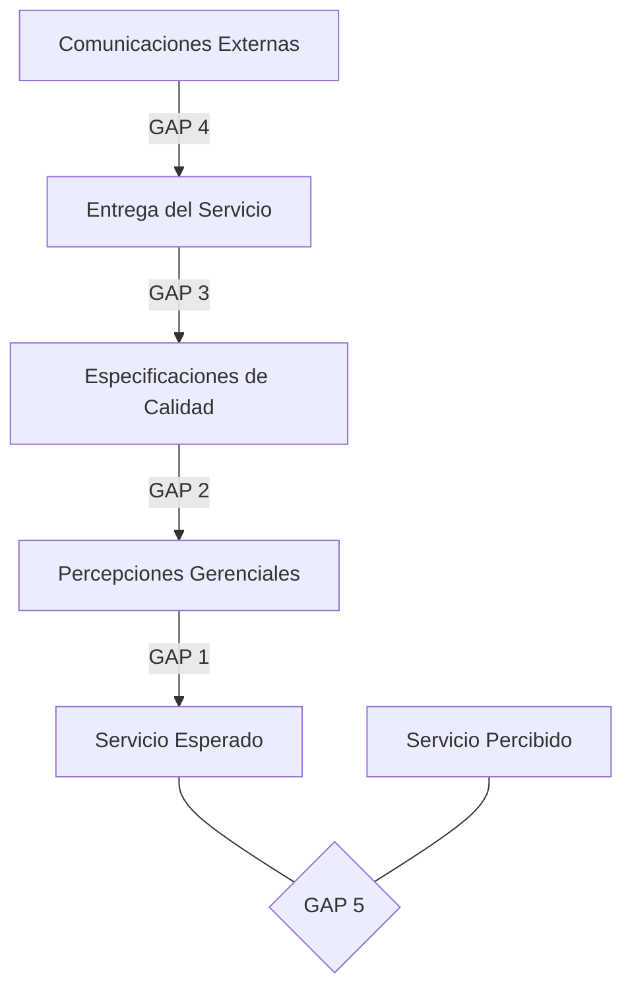

# Clase 28: Calidad de Servicio

## 🎯 Introducción

La calidad de servicio se puede comparar con la experiencia de visitar un restaurante: tenemos ciertas expectativas y luego vivimos una experiencia real. Al igual que un chef debe conocer las expectativas de sus comensales para satisfacerlos, las empresas deben entender y gestionar la diferencia entre lo que el cliente espera y lo que realmente recibe.

### ¿Qué es la Calidad de Servicio?

La calidad de servicio depende de las expectativas del cliente y se puede definir matemáticamente como:

CALIDAD = Percepción de lo recibido - Expectativas

Esta relación puede dar lugar a tres escenarios:

- P < E: Servicio deficiente
- P = E: Servicio satisfactorio
- P > E: Servicio excepcional

> 💡 La lealtad del cliente no se logra solo con satisfacción, sino con deleite.

## 📊 Dimensiones de la Calidad de Servicio

### 1. Dimensiones Tangibles

Las dimensiones tangibles se refieren a los aspectos físicos y materiales del servicio que pueden influir en la percepción del cliente. Incluyen:

- Apariencia física: La limpieza y el orden del entorno.
- Equipamiento: La modernidad y el estado de los equipos utilizados.
- Personal: La presentación y profesionalismo del personal.
- Materiales de comunicación: La claridad y calidad de los documentos y medios de comunicación.

### 2. Dimensiones Intangibles

Las dimensiones intangibles son aquellas que no se pueden tocar pero que afectan significativamente la percepción del servicio. Estas incluyen:

- **Confiabilidad**: La capacidad de realizar el servicio de manera confiable y precisa.
- **Respuesta**: La disposición y capacidad de ayudar a los clientes y proporcionar un servicio rápido.
- **Competencia**: La posesión de las habilidades y conocimientos necesarios para realizar el servicio.
- **Cortesía**: La amabilidad y respeto mostrado hacia los clientes.
- **Credibilidad**: La confianza y honestidad percibida por los clientes.
- **Seguridad**: La ausencia de peligros, riesgos o dudas.
- **Acceso**: La facilidad de contacto y disponibilidad del servicio.
- **Comunicación**: La claridad y efectividad en la transmisión de información.
- **Entendimiento**: El esfuerzo por conocer y comprender las necesidades del cliente.

## 💻 Modelo de Brechas (GAP)

El modelo de brechas identifica cinco brechas críticas que pueden afectar la calidad del servicio:

### Brecha 1: No saber lo que espera el cliente

- Investigación de mercado inadecuada
- Comunicación vertical deficiente
- Excesivos niveles jerárquicos

### Brecha 2: Diseño inadecuado del servicio

- Ausencia de estándares
- Falta de conexión con el posicionamiento
- Proceso no sistemático

### Brecha 3: No entregar según especificaciones

- Deficiencias en recursos humanos
- Problemas con la demanda
- Intermediarios

### Brecha 4: No comunicar correctamente

- Marketing no integrado
- Promesas excesivas
- Comunicación horizontal deficiente

### Brecha 5: Gap del cliente

- Diferencia entre expectativas y percepciones

## 📈 Ciclos de Servicio

### Ciclo del Fracaso

- Alta rotación de clientes: Los clientes no regresan debido a experiencias negativas.
- Baja lealtad: Los clientes no desarrollan un compromiso con la empresa.
- Énfasis en nuevos clientes: Se invierte más en atraer nuevos clientes que en retener a los existentes.
- Bajos márgenes: Las ganancias son menores debido a la falta de clientes leales.
- Personal desmotivado: Los empleados no están comprometidos ni motivados.

### Ciclo del Éxito

- Baja rotación de clientes: Los clientes regresan debido a experiencias positivas.
- Alta lealtad: Los clientes desarrollan un compromiso con la empresa.
- Énfasis en retención: Se invierte en mantener a los clientes existentes.
- Mayores márgenes: Las ganancias son mayores debido a la lealtad de los clientes.
- Personal comprometido: Los empleados están motivados y comprometidos con su trabajo.

## 🎓 Ejercicio Práctico

Analizar un servicio usando el modelo GAP:

1. Identificar expectativas del cliente
2. Evaluar percepciones actuales
3. Calcular brechas
4. Proponer mejoras

## 🔑 Consejos Clave

1. La satisfacción no es suficiente; buscar el deleite
2. Integrar todas las dimensiones de calidad
3. Gestionar activamente las brechas
4. Invertir en personal y procesos
5. Mantener comunicación consistente

## 📝 Conclusión

La calidad de servicio es un sistema integral que requiere atención a múltiples dimensiones y la gestión activa de brechas. El éxito sostenible se logra cuando las percepciones superan consistentemente las expectativas.

## 📚 Fórmulas Relevantes

$Calidad_{Servicio} = Percepción_{recibido} - Expectativas$

$Satisfacción_{Cliente} = f(Calidad_{Servicio})$

$Lealtad = f(Satisfacción_{Total})$

## 🔍 Recursos Adicionales

- "Delivering Quality Service" - Zeithaml, Parasuraman, Berry
- Modelo SERVQUAL para medición de calidad
- Herramientas de gestión de experiencia del cliente
