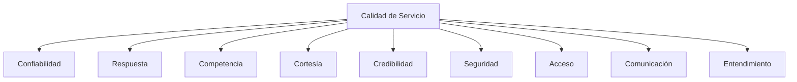
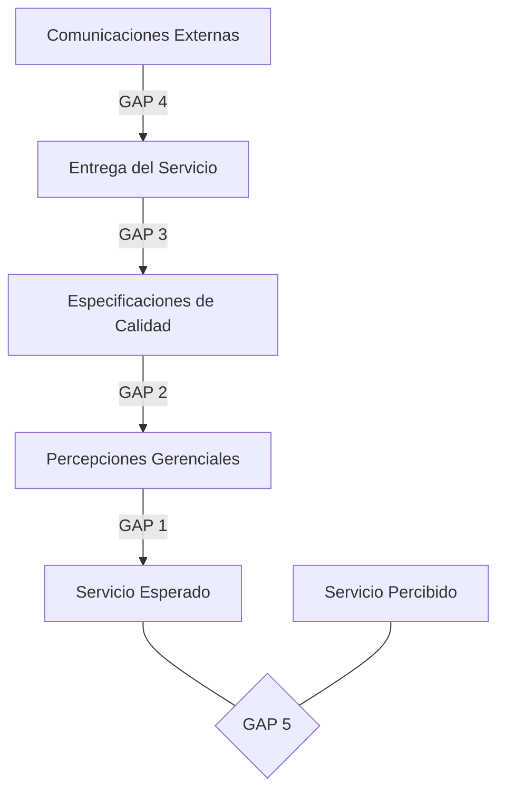

# Clase 28: Calidad de Servicio

## 🎯 Introducción

La calidad de servicio es como la diferencia entre las expectativas que tenemos al entrar a un restaurante y la experiencia real que vivimos. Así como un chef debe entender qué espera cada comensal para poder deleitarlo, las empresas deben comprender y gestionar la brecha entre lo que el cliente espera y lo que realmente recibe.

### ¿Qué es la Calidad de Servicio?

La calidad de servicio es una función de las expectativas del cliente, definida matemáticamente como:

CALIDAD = Percepción de lo recibido - Expectativas

Esta relación puede resultar en tres escenarios:

- P < E: Servicio deficiente
- P = E: Servicio satisfactorio
- P > E: Servicio excepcional

> 💡 La lealtad no se logra con satisfacción, se logra con deleite.

## 📊 Dimensiones de la Calidad de Servicio

### 1. Dimensiones Tangibles

- Apariencia física
- Equipamiento
- Personal
- Materiales de comunicación

### 2. Dimensiones Intangibles

## 💻 Modelo de Brechas (GAP)

El modelo identifica cinco brechas críticas:

### Brecha 1: No saber lo que espera el cliente

- Investigación de mercado inadecuada
- Comunicación vertical deficiente
- Excesivos niveles jerárquicos

### Brecha 2: Diseño inadecuado del servicio

- Ausencia de estándares
- Falta de conexión con el posicionamiento
- Proceso no sistemático

### Brecha 3: No entregar según especificaciones

- Deficiencias en recursos humanos
- Problemas con la demanda
- Intermediarios

### Brecha 4: No comunicar correctamente

- Marketing no integrado
- Promesas excesivas
- Comunicación horizontal deficiente

### Brecha 5: Gap del cliente

- Diferencia entre expectativas y percepciones

## 📈 Ciclos de Servicio

### Ciclo del Fracaso

- Alta rotación de clientes
- Baja lealtad
- Énfasis en nuevos clientes
- Bajos márgenes
- Personal desmotivado

### Ciclo del Éxito

- Baja rotación de clientes
- Alta lealtad
- Énfasis en retención
- Mayores márgenes
- Personal comprometido

## 🎓 Ejercicio Práctico

Analizar un servicio usando el modelo GAP:

1. Identificar expectativas del cliente
2. Evaluar percepciones actuales
3. Calcular brechas
4. Proponer mejoras

## 🔑 Consejos Clave

1. La satisfacción no es suficiente; buscar el deleite
2. Integrar todas las dimensiones de calidad
3. Gestionar activamente las brechas
4. Invertir en personal y procesos
5. Mantener comunicación consistente

## 📝 Conclusión

La calidad de servicio es un sistema integral que requiere atención a múltiples dimensiones y la gestión activa de brechas. El éxito sostenible se logra cuando las percepciones superan consistentemente las expectativas.

## 📚 Fórmulas Relevantes

$Calidad_{Servicio} = Percepción_{recibido} - Expectativas$

$Satisfacción_{Cliente} = f(Calidad_{Servicio})$

$Lealtad = f(Satisfacción_{Total})$

## 🔍 Recursos Adicionales

- "Delivering Quality Service" - Zeithaml, Parasuraman, Berry
- Modelo SERVQUAL para medición de calidad
- Herramientas de gestión de experiencia del cliente
