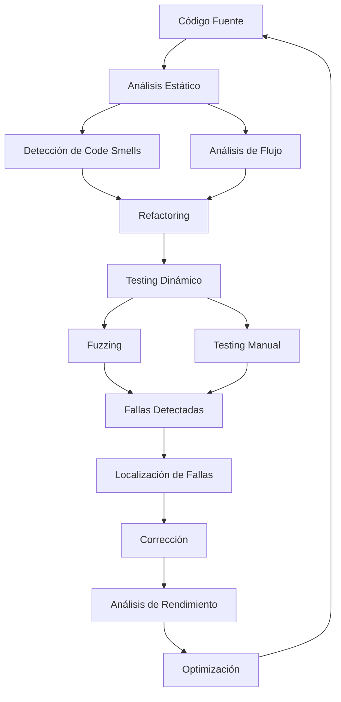

# 1. FUNDAMENTOS DEL TESTING

El testing moderno combina diferentes técnicas complementarias para encontrar defectos, verificar comportamiento y optimizar rendimiento. La integración de análisis estático, fuzzing, localización de fallas y análisis de rendimiento proporciona una estrategia completa de testing.

## 1.1 Flujo de Trabajo Integrado



1. Análisis del Código

   - Revisión estática
   - Identificación de problemas potenciales
   - Mejoras de diseño

2. Testing Dinámico

   - Generación de casos de prueba
   - Ejecución automatizada
   - Detección de fallas

3. Localización y Corrección

   - Identificación precisa de defectos
   - Corrección y verificación
   - Regresión testing

4. Optimización
   - Análisis de rendimiento
   - Mejoras de eficiencia
   - Verificación de mejoras

## 1.2 Conceptos Fundamentales

### 1.2.1 Tipos de Testing

```python
def test_strategy(code_base):
    """Ejemplo de estrategia completa de testing"""
    # 1. Análisis Estático
    static_issues = perform_static_analysis(code_base)
    if static_issues:
        fix_static_issues(static_issues)

    # 2. Testing Dinámico
    test_suite = generate_test_suite(code_base)
    results = execute_tests(test_suite)

    # 3. Fuzzing
    fuzzer = setup_fuzzing(code_base)
    fuzzing_results = fuzzer.run()

    # 4. Localización de Fallas
    if results.failures or fuzzing_results.crashes:
        locate_faults(results.failures + fuzzing_results.crashes)

    # 5. Análisis de Rendimiento
    performance_metrics = measure_performance(code_base)
    optimize_if_needed(performance_metrics)
```

El testing se puede clasificar en varios tipos, cada uno con un propósito específico. El análisis estático se realiza sin ejecutar el código, identificando problemas potenciales. El testing dinámico implica la ejecución de pruebas para verificar el comportamiento del software. El fuzzing genera entradas aleatorias para descubrir fallos inesperados. La localización de fallas se enfoca en identificar y corregir defectos. Finalmente, el análisis de rendimiento evalúa la eficiencia del software y sugiere optimizaciones.

### 1.2.2 Métricas de Testing

```python
class TestingMetrics:
    def __init__(self):
        self.coverage = Coverage()
        self.performance = PerformanceMetrics()
        self.fault_detection = FaultDetectionRate()

    def calculate_effectiveness(self):
        """Calcula efectividad general del testing"""
        coverage_score = self.coverage.get_score()
        performance_score = self.performance.get_score()
        fault_score = self.fault_detection.get_score()

        return {
            'coverage': coverage_score,
            'performance': performance_score,
            'fault_detection': fault_score,
            'overall': (coverage_score + performance_score + fault_score) / 3
        }
```

Las métricas de testing son esenciales para evaluar la calidad y efectividad de las pruebas realizadas. Estas métricas incluyen la cobertura del código, que mide qué porcentaje del código ha sido ejecutado durante las pruebas; el rendimiento, que evalúa la eficiencia de las pruebas en términos de tiempo y recursos; y la tasa de detección de fallos, que indica la capacidad de las pruebas para identificar defectos en el software. Al combinar estas métricas, se puede obtener una visión integral de la efectividad del proceso de testing.

### 1.2.3 Integración de Herramientas

```python
class TestingToolchain:
    def __init__(self):
        self.static_analyzer = StaticAnalyzer()
        self.fuzzer = Fuzzer()
        self.fault_locator = FaultLocator()
        self.profiler = Profiler()

    def setup_pipeline(self):
        """Configura pipeline de testing"""
        pipeline = [
            self.static_analyzer.analyze,
            self.fuzzer.fuzz,
            self.fault_locator.locate,
            self.profiler.profile
        ]
        return Pipeline(pipeline)

    def run_comprehensive_testing(self, code_base):
        """Ejecuta testing comprehensivo"""
        pipeline = self.setup_pipeline()
        results = pipeline.execute(code_base)
        return self.generate_report(results)
```
