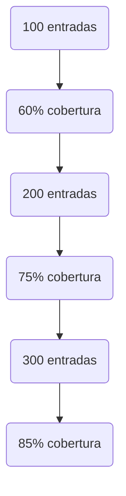

# Entendiendo el Code Coverage y sus Aplicaciones en el Testing

## ¿Qué es el Code Coverage?

El Code Coverage o cobertura de código es una medida que nos permite determinar qué tan exhaustivamente se ha probado un programa. Nos indica qué partes del código se han ejecutado durante las pruebas y cuáles no.

Imagina que tienes un mapa de una ciudad y quieres asegurarte de haber visitado todas las calles. El Code Coverage sería como marcar en el mapa cada calle que has recorrido. Al final, podrás ver fácilmente qué calles te faltan por visitar.

Existen diferentes tipos de métricas de coverage, siendo las más comunes:

- **Statement Coverage**: Mide la cantidad de líneas de código ejecutadas.
- **Branch Coverage**: Mide la cantidad de ramificaciones (como sentencias if/else) ejecutadas.
- **Function Coverage**: Mide la cantidad de funciones ejecutadas.

Generalmente, se considera que un buen nivel de cobertura es del 80% o más.

## Enfoques de Testing: Black-Box vs White-Box

Cuando se trata de crear pruebas para nuestro código, podemos adoptar dos enfoques principales: Black-Box Testing y White-Box Testing.

### Black-Box Testing

En el Black-Box Testing, diseñamos las pruebas basándonos en las especificaciones y el comportamiento esperado del programa, sin preocuparnos por los detalles internos de implementación.

Es como probar un coche: verificas que arranca, que frena, que las luces funcionan, etc., pero no te preocupas por cómo está implementado el motor o el sistema eléctrico.

### White-Box Testing

Por otro lado, en el White-Box Testing, nos enfocamos en la estructura interna del código para asegurarnos de que todas las líneas, ramas y funciones se ejecuten durante las pruebas.

Es como si abrieras el capó del coche y verificaras que cada componente del motor funciona correctamente.

El White-Box Testing suele ir de la mano con el Code Coverage, ya que buscamos alcanzar ciertos criterios de cobertura para considerar que nuestras pruebas son suficientes.

## Midiendo el Code Coverage

Python nos ofrece herramientas para medir el Code Coverage de forma sencilla. Una de ellas es la función `sys.settrace()`, que nos permite hacer un seguimiento de qué líneas de código se ejecutan.

Ejemplo de una clase `Coverage`:

```python
class Coverage:
    def traceit(self, frame, event, arg):
        if event == "line":
            lineno = frame.f_lineno
            self._trace.append(lineno)
        return self.traceit

    def __enter__(self):
        self.original_trace_function = sys.gettrace()
        sys.settrace(self.traceit)
        return self

    def __exit__(self, exc_type, exc_value, tb):
        sys.settrace(self.original_trace_function)

with Coverage() as cov:
    function_to_be_traced()
```

En este ejemplo, la clase `Coverage` utiliza `sys.settrace()` para registrar qué líneas se ejecutan. Podemos usar esta información para calcular el porcentaje de cobertura y para saber qué partes del código no se han ejecutado.

## Aplicaciones del Code Coverage

### Comparación de Cobertura

Podemos usar operaciones de conjuntos para comparar la cobertura lograda por diferentes casos de prueba. Esto nos permite identificar qué líneas aún no están cubiertas y nos da una idea de cómo mejorar nuestras pruebas.

### Fuzzing y Code Coverage

El fuzzing es una técnica donde generamos entradas aleatorias para probar nuestro programa. Podemos usar el Code Coverage para evaluar la efectividad del fuzzing, viendo cómo aumenta la cobertura a medida que agregamos más entradas aleatorias.

Ejemplo de cómo la cobertura aumenta con el número de entradas de fuzzing:



### Encontrando Errores con Fuzzing

Una de las ventajas del fuzzing es que puede encontrar errores internos en nuestro código incluso sin necesidad de verificar el resultado final. Si una entrada aleatoria causa que el programa falle o lance una excepción, sabemos que hemos encontrado un error.

## Limitaciones del Code Coverage

Es importante tener en cuenta que aunque el Code Coverage es una métrica útil, no es perfecta. Alcanzar un 100% de cobertura no garantiza que el programa esté libre de errores.

Imagina que tienes un programa que suma dos números. Puedes tener una prueba que verifique que `2 + 2 = 4`, y esto te daría un 100% de cobertura. Pero si la implementación de la suma es incorrecta, digamos que en lugar de sumar, resta, tu prueba no detectaría este error.

Por eso, el Code Coverage debe ser usado junto con otras técnicas de prueba, como pruebas unitarias bien diseñadas, fuzzing, y pruebas de integración.

En resumen, el Code Coverage es una herramienta valiosa en el testing de software, pero no es una bala de plata. Nos ayuda a entender qué partes de nuestro código han sido ejecutadas durante las pruebas, pero no garantiza la ausencia de errores. Usar el Code Coverage junto con otras técnicas nos dará una estrategia de pruebas más sólida y completa.
